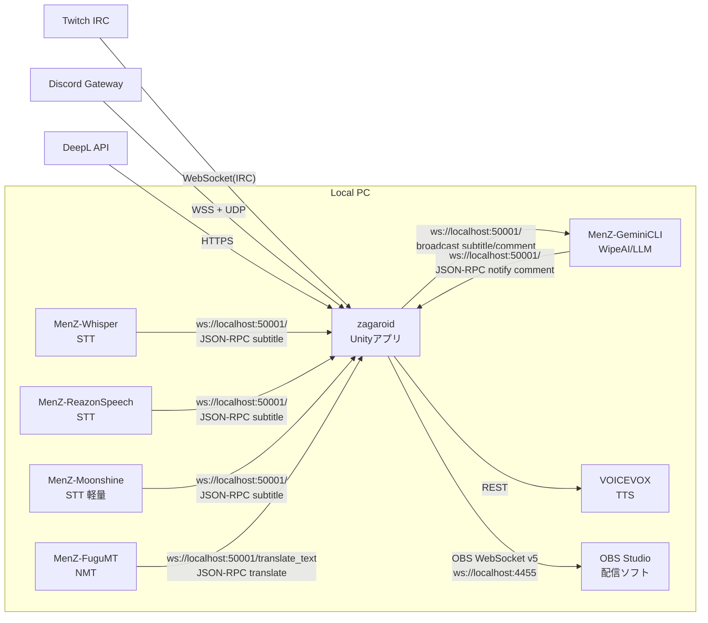
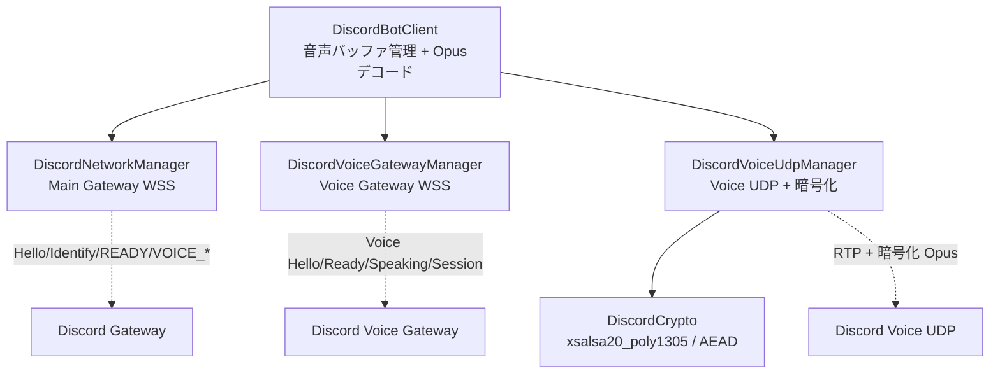
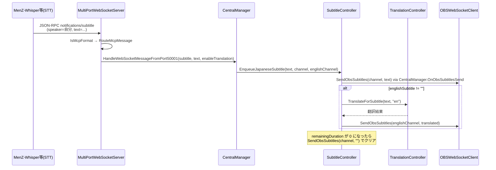
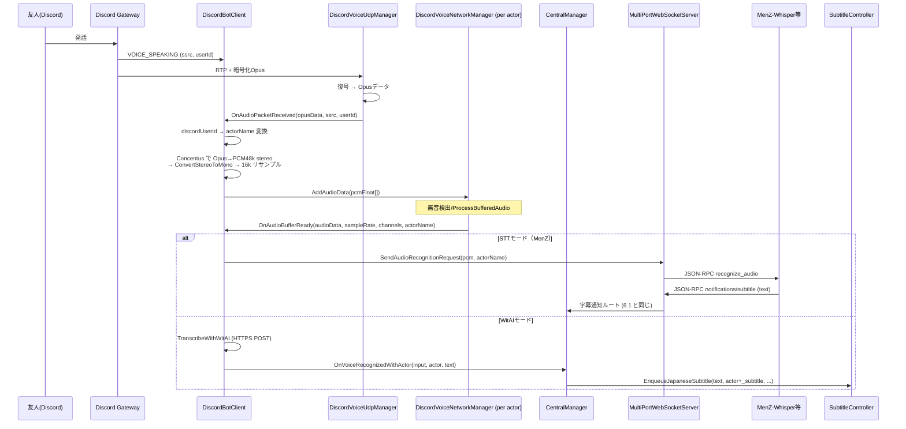
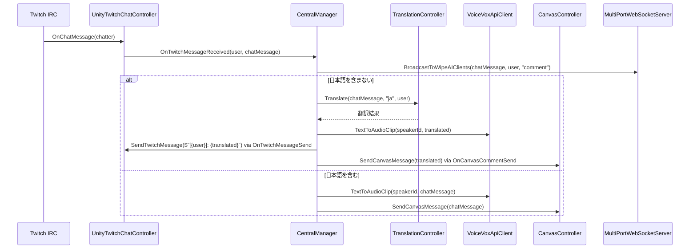
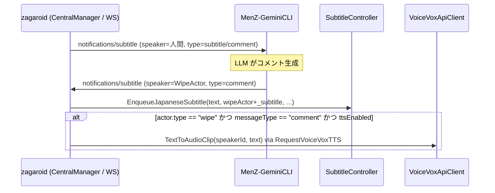

# zagaroid アーキテクチャ

> **このドキュメントが扱う範囲**: zagaroid 本体（Unityアプリ）の全体構成・主要コンポーネント・データフロー・通信プロトコル・スレッドモデル・設定永続化方式。
> **扱わない範囲**: 各機能の詳細仕様（→ `features/`）、外部サービス個別のプロトコル詳細（→ `integrations/`）、兄弟リポジトリの内部実装（→ `companion-apps.md`、各 `MenZ-*` リポジトリ）。

## 1. アプリケーションの位置づけ

zagaroid は配信者本人の PC 上で動作する **配信支援デスクトップアプリ** で、Unity（uGUI + UI Toolkit）で実装されている。
担う機能を一言で要約すると:

> **「自分・友人・AI の発話／チャットを、字幕化・翻訳・読み上げ・アバター演出して、OBS 経由で配信に流す」**

主要なユースケースは次の 4 つ:

1. **自分の音声を字幕化して配信に出す**（外部 STT 兄弟アプリ → zagaroid → OBS）
2. **Discord ボイスチャットの友人発話を字幕化して配信に出す**（zagaroid 内蔵 Discord BOT → STT → OBS）
3. **Twitch チャットを翻訳・読み上げ・ニコ風スクロール表示する**（Twitch IRC → zagaroid → VOICEVOX / NDI Canvas）
4. **AI コメンテーター（ワイプ AI）に字幕を読ませてコメントを生成・読み上げ・表示する**（zagaroid → MenZ-GeminiCLI → zagaroid → VOICEVOX / Avatar）

zagaroid 自体は STT・NMT・LLM の重い処理は持たず、**「ハブ」として動作**する。重い処理は兄弟リポジトリ（`MenZ-Whisper` / `MenZ-FuguMT` / `MenZ-ReazonSpeech` / `MenZ-Moonshine` / `MenZ-GeminiCLI`）にローカル WebSocket で委譲する。

## 2. 技術スタック

| 領域 | 採用技術 |
| :-- | :-- |
| ランタイム | Unity（uGUI + UI Toolkit、Newtonsoft.Json、TextMeshPro） |
| 配信連携 | OBS WebSocket v5、Klak NDI（`jp.keijiro.klak.ndi`） |
| WebSocket サーバ／クライアント | WebSocketSharp（サーバ＋クライアント）、`System.Net.WebSockets.ClientWebSocket`（Discord Gateway） |
| Discord 連携 | **自前実装**（SDK 不使用）。Gateway は `ClientWebSocket`、音声受信は UDP（`UdpClient`）、Opus デコードは `Concentus`、暗号化は自前（`xsalsa20_poly1305` 系 ＋ AEAD AES-GCM / XChaCha20）、`TweetNaclSharp` を内包 |
| Twitch 連携 | `lexonegit/Unity-Twitch-Chat`（IRC over WebSocket） |
| TTS | VOICEVOX（`localhost:50021` REST） |
| 翻訳 | DeepL Free API（HTTPS REST） / `MenZ-FuguMT`（ローカル NMT、JSON-RPC over WebSocket） |
| ファイルダイアログ | `StandaloneFileBrowser`（Plugins） |
| 永続化 | `PlayerPrefs`（API キー・設定値・Actor 配列を JSON 化して格納） |

ランタイム（`Zagaroid.Runtime`）と EditMode テスト（`Zagaroid.EditModeTests`）の 2 つの asmdef で構成される。

- `Assets/Scripts/Zagaroid.Runtime.asmdef`
- `Assets/Tests/EditMode/Zagaroid.EditModeTests.asmdef`

## 3. リポジトリ全体像

zagaroid 単体では完結せず、ローカル PC 上で複数アプリが同時起動して連携する分散構成である。



zagaroid 側は **WebSocket サーバ** としてポート `50001` / `50002` を待ち受ける（`Assets/Scripts/WebSockets/MultiPortWebSocketServer.cs`）。`MenZ-*` 兄弟アプリはすべてこちらに **クライアントとして接続してくる** 形になっている。

CentralManager から対応する `Start*` を呼ぶことで、`run.bat` などの起動スクリプトを子プロセスとして起動できる（`StartExternalProgram`、`Assets/Scripts/CentralManager.cs:472-529`）。これは「PC上で複数アプリを揃えて起動する」運用を簡素化するためのもの。

## 4. シーンと GameObject 構成

シーンは現状 1 つのみ:

- `Assets/Scenes/SampleScene.unity`

主要な GameObject は次の 7 系統:

| GameObject 系統 | 役割 | 主要スクリプト |
| :-- | :-- | :-- |
| **CentralManager** | アプリ全体のハブ。設定の永続化、各種イベントの発火・購読、外部プロセス起動 | `Assets/Scripts/CentralManager.cs` |
| **MultiPortWebSocketServer** | ポート50001/50002で待ち受ける WebSocket サーバ。MCP風 JSON-RPC のルーティング | `Assets/Scripts/WebSockets/MultiPortWebSocketServer.cs` |
| **DiscordBotClient** | Discord Gateway / Voice Gateway / Voice UDP の3層を統括 | `Assets/Scripts/Discord/DiscordBotClient.cs` |
| **SubtitleController** | 字幕の受付・キュー管理・表示時間制御・OBS送出依頼 | `Assets/Scripts/Subtitle/SubtitleController.cs` |
| **TranslationController** | DeepL / NMT を切替＆フォールバックする統合翻訳ファサード | `Assets/Scripts/Translation/TranslationController.cs` |
| **OBS / Twitch / VoiceVox** | 各外部サービスとの I/O | `Assets/Scripts/WebSockets/OBSWebSocketClient.cs` / `Assets/Scripts/Twitch/UnityTwitchChatController.cs` / `Assets/Scripts/VoiceVox/VoiceVoxApiClient.cs` |
| **Canvas 群** | Main / Log / Setting / Actor の各 Canvas と UI Toolkit ルート | `Assets/Scripts/Canvases/*` / `Assets/Scripts/UI/*` |

UI は Canvas（uGUI、配信に映る側）と UI Toolkit（`Assets/UI Toolkit/MainMenu.uxml` 等、配信に映らないメニュー側）が併存する。タブ切替は `Assets/Scripts/UI/TabController.cs`、UGUI のドラッグ移動は `Assets/Scripts/UI/UIDragMove.cs`。

> **「Main Canvas は配信に映る／Log Canvas・UI Toolkit メニューは映らない」** という規約で運用されている。`Assets/Scripts/WindowSizeController.cs` がウィンドウサイズと Canvas の対応を管理する。

## 5. コアコンポーネント

### 5.1 `CentralManager`（ハブ）

- ファイル: `Assets/Scripts/CentralManager.cs`
- 役割:
  - **シングルトン**（`CentralManager.Instance`、`DontDestroyOnLoad` は付与していない）
  - **設定の永続化**: `PlayerPrefs` を経由して全設定を Get/Set する API を一括提供（`GetDeepLApiClientKey()` 等）
  - **Actor 配列の永続化**: `ActorConfig` のリストを Newtonsoft.Json で JSON 化して `PlayerPrefs["Actors"]` に格納（`Vector2Converter` で循環参照回避）
  - **イベント中継**: 各種 `static event` を介してコンポーネント間を疎結合に繋ぐ
  - **外部プロセス起動**: `StartSubtitleAI()` / `StartVoiceVox()` / `StartMenzTranslation()` / `StartDiscordBot()`。プラットフォームごとに `.sh` / `.bat` の起動方法を切り替える
  - **「Twitch コメント受信」「Discord 音声認識結果」「WebSocket 字幕」をハンドルし、字幕表示・翻訳・読み上げ・Wipe AI ブロードキャストにルーティング**

主要な `static event`（コンポーネント間の薄いバス）:

| イベント | 送信側 | 受信側 | 用途 |
| :-- | :-- | :-- | :-- |
| `OnTwitchMessageReceived` | `UnityTwitchChatController` | `CentralManager` | Twitch コメント受信 |
| `OnTwitchMessageSend` | `CentralManager` | `UnityTwitchChatController` | Twitch コメント送信 |
| `OnVoiceRecognizedWithActor` | `DiscordBotClient` | `CentralManager` | Discord 音声 → 認識テキスト（actor 付き） |
| `OnDiscordBotStateChanged` / `OnDiscordLoggedIn` / `OnDiscordLog` | `DiscordBotClient` | `CentralManager` | BOT 状態通知 |
| `OnMessageReceivedFromPort50001` / `OnMessageReceivedFromPort50002` | `MultiPortWebSocketServer` | `CentralManager` | レガシー字幕受信（MCP 以外） |
| `OnObsSubtitlesSend` | `SubtitleController` / `CentralManager` | `OBSWebSocketClient` | OBS 字幕ソース更新 |
| `OnCanvasCommentSend` | `CentralManager` | `CanvasController` | ニコ風スクロール表示 |
| `OnLipSyncLevel` / `OnSpeakingChanged` | `DiscordBotClient` 等 | `FaceAnimatorController` / `MainCanvasAvatarController` | 口パク・アバター表示 |
| `FaceVisibilityChanged` | `CentralManager` / `DiscordBotClient` | `FaceAnimatorController` | 顔表示の ON/OFF |
| `OnActorsChanged` | `CentralManager` | `MainCanvasAvatarController` 等 | Actor 編集の波及 |

> **設計方針メモ**: 当初 Manager クラス群（`TranslationManager` 等）に分けて参照キャッシュする計画だったが、現状は `CentralManager` 自身がコルーチンを走らせる構造になっている（`Assets/Scripts/CentralManager.cs:31-37` のコメント）。`SubtitleController` / `TranslationController` は後から切り出された部分で、これらは singleton として `CentralManager` から呼び出される。

### 5.2 `MultiPortWebSocketServer`（ローカル統合バス）

- ファイル: `Assets/Scripts/WebSockets/MultiPortWebSocketServer.cs`
- 役割:
  - WebSocketSharp で **ポート 50001 と 50002** を待ち受ける
  - `50001` 配下に 2 つのパスを公開:
    - `/` （`EchoService1`）— 字幕・音声認識・Wipe ブロードキャスト用
    - `/translate_text` （`TranslationService`）— 翻訳クライアント（NMT）専用
  - `50002` （`EchoService2`）— 旧字幕互換用（現状ほぼ未使用）
  - 受信メッセージが **JSON-RPC 2.0 形式かどうか**で振り分け（`IsMcpFormat`）:
    - JSON-RPC かつ `method=notifications/subtitle` → `CentralManager.HandleWebSocketMessageFromPort50001()` → `SubtitleController.EnqueueJapaneseSubtitle()`、加えて Wipe AI クライアントへ転送
    - JSON-RPC かつ `id` を持つレスポンス → `TranslationController.OnWebSocketMessage()` （翻訳結果の返却）
    - 非 JSON-RPC（旧ゆかコネ系） → 互換ルーチン
  - **送信系 API**:
    - `BroadcastToWipeAIClients(text, speaker, type)`: `/` 全クライアントへ字幕/コメントをブロードキャスト
    - `SendAudioRecognitionRequest(audioData, speaker, sampleRate)`: `MenZ-ReazonSpeech` 等への音声認識リクエスト（PCM16LE → Base64）
    - `SendToTranslationClient(message)`: `/translate_text` の翻訳クライアントへ送信

> **重要**: 50001 の `/` には **複数種類のクライアント**（STT、Wipe AI、コメント生成 LLM 等）が同時接続しうる。`Sessions.Broadcast()` で投げるため、各クライアント側で「自分宛のメソッドだけ拾う」運用になっている。

### 5.3 `SubtitleController`

- ファイル: `Assets/Scripts/Subtitle/SubtitleController.cs`
- 役割:
  - 字幕の **チャネル別キュー管理**（`subtitleQueuesByChannel`）と **現在表示中字幕の保持**（`currentDisplayByChannel`）
  - 表示時間は文字数ベース（`CharactersPerSecond` / `MinDisplayTime` / `MaxDisplayTime` の3設定）で計算
  - 既に表示中なら **「結合表示」**、結合中ならキューに積む、というルールで重なり制御
  - `Update()` で残り時間を減算し、終了時に OBS の該当ソースを空文字でクリア＋次キューを表示
  - 英語字幕が指定されていれば `CentralManager.TranslateForSubtitle()` 経由で `TranslationController` に翻訳依頼

「チャネル」とは OBS 側の字幕ソース名のことで、`actorName + "_subtitle"` の規約で命名する（例: `zagan_subtitle`）。

### 5.4 `TranslationController`

- ファイル: `Assets/Scripts/Translation/TranslationController.cs`
- 役割:
  - `Translate(text, targetLang, speaker, callback)` という統合API。`PlayerPrefs["TranslationMode"]` の値（`"deepl"` または `"NMT"`）に従って優先翻訳→失敗時にフォールバック
  - **DeepL** は `https://api-free.deepl.com/v2/translate` への直接 REST 呼び出し
  - **NMT** は `MultiPortWebSocketServer.SendToTranslationClient()` 経由で MenZ-FuguMT へ JSON-RPC リクエスト送信、レスポンスは `OnWebSocketMessage()` で受け取り 10 秒タイムアウト付き
  - リクエストID（GUID）→ コールバックの対応を `pendingRequests` で管理
  - `DetectSourceLanguage()` で簡易言語判定（`ja` / `zh` / `ko` / `ru` / `en`）し、同一言語なら翻訳をスキップ

### 5.5 Discord 自前実装の3層構成

Discord SDK は使わず**自前で WebSocket（Gateway）+ UDP（音声）+ 暗号化**を実装している。これは Unity / IL2CPP 環境で動く SDK 制約への対応と、BGM 等で取られている仮想音源デバイスを節約する目的の双方から来ている（`README.md` 参照）。



| クラス | ファイル | 担当 |
| :-- | :-- | :-- |
| `DiscordBotClient` | `Assets/Scripts/Discord/DiscordBotClient.cs` | 全体のオーケストレーション。Opus → PCM16k mono 変換、`actorName` ごとの音声バッファ管理、Wit.AI / MenZ-STT 切替 |
| `DiscordNetworkManager` | `Assets/Scripts/Discord/DiscordNetworkManager.cs` | Main Gateway（`wss://gateway.discord.gg/?v=10&encoding=json`）。Heartbeat、Identify、`VOICE_STATE_UPDATE` / `VOICE_SERVER_UPDATE` の dispatch |
| `DiscordVoiceGatewayManager` | `Assets/Scripts/Discord/DiscordVoiceGatewayManager.cs` | Voice Gateway。`VOICE_HELLO` → `VOICE_READY` → `SELECT_PROTOCOL` → `SESSION_DESCRIPTION`、`SPEAKING` イベント |
| `DiscordVoiceUdpManager` | `Assets/Scripts/Discord/DiscordVoiceUdpManager.cs` | UDP 受信、IP Discovery、暗号化モード選択（`aead_aes256_gcm_rtpsize` / `aead_xchacha20_poly1305_rtpsize` / `xsalsa20_poly1305_*`）、Keep Alive、無音タイムアウト検出 |
| `DiscordCrypto` | `Assets/Scripts/Discord/DiscordCrypto.cs` | RTP ペイロードの復号 |
| `DiscordJsonSerialization` | `Assets/Scripts/Discord/DiscordJsonSerialization.cs` | JSON シリアライザ設定 |

複数話者への対応として、Discord User ID → `ActorConfig.actorName` のマッピングを起動時にキャッシュし（`_discordUserIdToActorName`）、actor ごとに `DiscordVoiceNetworkManager`（音声バッファ）を作る。SSRC は UDP 層で管理される。

字幕化の経路は2系統:

1. **Wit.AI モード** （`DiscordSubtitleMethod="WitAI"`）: `DiscordBotClient` 内で直接 `https://api.wit.ai/speech` に raw PCM を POST → 認識テキストを `OnVoiceRecognizedWithActor` で発火
2. **STT モード**（`DiscordSubtitleMethod="STT"`、旧称 MenZ）: PCM を `MultiPortWebSocketServer.SendAudioRecognitionRequest()` 経由で `MenZ-Whisper` / `MenZ-ReazonSpeech` 等に投げ、結果は通常の字幕通知として戻ってくる

### 5.6 UI の二層構造

- **uGUI Canvas（配信に映る側）**:
  - `Main Canvas` — アバター画像・コメントスクロール・字幕など、配信に映る要素
  - `Log Canvas` — `Application.logMessageReceived` を購読してログを表示（`Assets/Scripts/Canvases/LogCanvasController.cs`）
- **UI Toolkit（配信に映らない設定 UI）**:
  - `Assets/UI Toolkit/MainMenu.uxml` — タブ切替（Log / Setting / Actor）
  - `Assets/UI Toolkit/AvatarSettingDialog.uxml` — Avatar 設定ダイアログ
  - `Assets/UI Toolkit/ActorDeleteConfirmDialog.uxml` — 削除確認ダイアログ
- **タブ＆操作モード制御**: `Assets/Scripts/UI/TabController.cs` がタブ切替に加え、最大化／最小化に応じて UGUI 側 `GraphicRaycaster` と `UIDragMove` を有効・無効化する（最大化中は uGUI のドラッグを止める）

カメラとレンダーターゲットの構成:

- **NDIカメラ** が `Main Canvas` を `RenderTexture` に焼いて NDI で OBS に送る
- `Assets/Scripts/Camera/GreenBackgroundController.cs` が背景をクロマキー用に保つ
- `Klak NDI` を使用（`jp.keijiro.klak.ndi`）

## 6. データフロー

主要な縦串（ユースケース別データフロー）を 4 本まとめる。

### 6.1 自分の音声 → 字幕

外部 STT（`MenZ-Whisper` 等）が `ws://localhost:50001/` にクライアントとして接続し、認識結果を JSON-RPC `notifications/subtitle` で送ってくる。



加えて、`speaker.type != "wipe"` であれば、同じテキストが `BroadcastToWipeAIClients()` で WipeAI（`MenZ-GeminiCLI`）にも転送される（→ 6.4 へ続く）。

### 6.2 Discord ボイス → 字幕



並行して、`DiscordVoiceNetworkManager.AddAudioData()` 内で算出した RMS 音量を `CentralManager.SendLipSyncLevel(level, actorName)` で発火し、対応する `FaceAnimatorController` / `MainCanvasAvatarController` がリップシンクに使う。

### 6.3 Twitch コメント → 翻訳・読み上げ・Canvas



各ユーザーに対して **「初コメ判定」** を行い、初コメなら `entranceSound` を一度だけ鳴らす。話者IDは `VoiceVoxApiClient.GetSpeakerRnd()` で初回ランダム決定し、以降同じユーザーには同じ話者IDを使う（`usersProfile`）。

### 6.4 ワイプ AI（コメント生成 LLM）連携

字幕・コメントを `MenZ-GeminiCLI` に転送し、生成されたコメントを字幕表示・TTS する片方向ループ。



ループ防止のため、Wipe 由来の字幕は `BroadcastToWipeAIClients()` で **Wipe へは再転送しない**ように `actor.type != "wipe"` のときのみブロードキャストする（`Assets/Scripts/WebSockets/MultiPortWebSocketServer.cs:206-210`）。

## 7. 通信プロトコル一覧

| プロトコル | 用途 | エンドポイント | 実装 |
| :-- | :-- | :-- | :-- |
| WebSocket（サーバ） | ローカル兄弟アプリ統合 | `ws://localhost:50001/`, `ws://localhost:50001/translate_text`, `ws://localhost:50002/` | `Assets/Scripts/WebSockets/MultiPortWebSocketServer.cs` |
| OBS WebSocket v5 | 字幕ソース更新 | `ws://localhost:4455` | `Assets/Scripts/WebSockets/OBSWebSocketClient.cs` |
| Discord Gateway v10 | BOT メイン接続 | `wss://gateway.discord.gg/?v=10&encoding=json` | `Assets/Scripts/Discord/DiscordNetworkManager.cs` |
| Discord Voice Gateway | ボイス接続調停 | `VOICE_SERVER_UPDATE` で動的取得 | `Assets/Scripts/Discord/DiscordVoiceGatewayManager.cs` |
| Discord Voice UDP（RTP） | 暗号化Opus音声受信 | Voice Server から動的取得 | `Assets/Scripts/Discord/DiscordVoiceUdpManager.cs` |
| Twitch IRC over WebSocket | チャット送受信 | `wss://irc-ws.chat.twitch.tv:443` | `Lexone.UnityTwitchChat`（Packages 経由） |
| DeepL REST | 翻訳 | `https://api-free.deepl.com/v2/translate` | `Assets/Scripts/Translation/TranslationController.cs` |
| Wit.AI REST | 音声認識（旧） | `https://api.wit.ai/speech` | `Assets/Scripts/Discord/DiscordBotClient.cs` |
| VOICEVOX REST | TTS | `http://localhost:50021` | `Assets/Scripts/VoiceVox/VoiceVoxApiClient.cs` |
| NDI | OBSへ映像配信 | NDIプロトコル（LAN） | `jp.keijiro.klak.ndi` |

### MCP 風 JSON-RPC 2.0 仕様

zagaroid と兄弟アプリの間は **JSON-RPC 2.0** をベースとした独自規約（コード上は "MCP" と表記されているが MCP 公式仕様とは別物）で会話する。

主なメソッド:

- `notifications/subtitle` （通知、`id` なし）— 字幕／コメント通知
  - `params.text` / `params.speaker` / `params.type` （`"subtitle"` or `"comment"`） / `params.language`
- `recognize_audio` （リクエスト、`id` あり）— 音声認識依頼（zagaroid → STT）
  - `params.speaker` / `params.audio_data`（PCM16LE Base64） / `params.sample_rate` / `params.channels=1` / `params.format="pcm16le"`
- `translate_text` （リクエスト、`id` あり）— 翻訳依頼（zagaroid → NMT、`/translate_text` パス）
  - `params.text` / `params.speaker` / `params.source_lang` / `params.target_lang` / `params.priority`

レスポンスは標準的な `{jsonrpc, id, result|error}` 形式（`Assets/Scripts/Translation/TranslationController.cs:354-401`）。

## 8. スレッドモデルと非同期境界

Unity は基本的に **メインスレッド単一実行**だが、本アプリには以下の別スレッドが存在する。

| スレッド／実行コンテキスト | 出処 |
| :-- | :-- |
| Unity メインスレッド | `Update()` / `Start()` / `Coroutine` |
| `WebSocketSharp` コールバック（サーバ側 `OnMessage` 等） | `MultiPortWebSocketServer` / `OBSWebSocketClient` |
| `System.Net.WebSockets.ClientWebSocket` 受信タスク | `DiscordNetworkManager` / `DiscordVoiceGatewayManager` |
| `UdpClient` 受信タスク | `DiscordVoiceUdpManager` |
| `Task.Run`（Opus デコード等） | `DiscordBotClient.OnAudioPacketReceived` |
| `System.Timers.Timer` ハートビート | `DiscordNetworkManager` / `DiscordVoiceGatewayManager` |

これらから Unity API（`MonoBehaviour.transform`、`AudioSource.Play()` 等）を直接呼ぶとクラッシュするため、メインスレッドへのディスパッチが必要。本アプリには **2系統のディスパッチャ**が存在する点に注意:

1. **`UnityMainThreadDispatcher`** （`Assets/Scripts/UnityMainThreadDispatcher.cs`）
   - 汎用シングルトン。`Instance().Enqueue(action)` でメインスレッドに積む
2. **`MultiPortWebSocketServer.Enqueue`** （内部キュー）
   - WebSocket サーバ側の専用キュー。`HandleMessage` 内で必ずこれに積んでからイベントを発火する
3. **`DiscordBotClient.EnqueueMainThreadAction`** （内部キュー）
   - Discord 系の各マネージャから渡されるコールバックで使用。`DiscordVoiceNetworkManager` のコンストラクタにも渡される

> **規約**: 別スレッドから Unity API を触る or `static event` を発火する際は **必ずいずれかのディスパッチャを通す**。新規コードを書く際は最寄りのコンポーネントが持つキューに積むのが原則。

非同期パターンは **コルーチン中心**（`StartCoroutine` + `yield return`）。`async/await` は Discord 系と HTTP リクエストで使用される。コルーチンと `async` の境界は基本的に各コンポーネント内で閉じる。

## 9. 設定の永続化

すべての設定は **`PlayerPrefs`** に保存される。すなわち macOS では `~/Library/Preferences/`、Windows ではレジストリ配下に置かれる。

主なキー（抜粋、`Assets/Scripts/CentralManager.cs` より）:

| キー | 型 | 用途 |
| :-- | :-- | :-- |
| `Actors` | string (JSON) | `List<ActorConfig>` を JSON 化したもの |
| `MyName` / `FriendName` | string | 自分／友人の表示名（旧設定、現在は Actor に統合移行中） |
| `MySubtitle` / `MyEnglishSubtitle` | string | OBS 字幕ソース名（旧設定） |
| `DeepLApiClientKey` | string | DeepL API キー |
| `ObsWebSocketsPassword` | string | OBS WebSocket パスワード |
| `RealtimeAudioWsUrl` | string | リアルタイム音声送信先（既定 `ws://127.0.0.1:60001`） |
| `TranslationMode` | string | `"deepl"` or `"NMT"` |
| `AutoStartSubtitleAI` / `AutoStartVoiceVox` / `AutoStartMenzTranslation` / `AutoStartDiscordBot` | int (0/1) | 各兄弟プロセスの自動起動フラグ |
| `SubtitleAIExecutionPath` / `VoiceVoxExecutionPath` / `MenzTranslationExecutionPath` | string | 各兄弟プロセスの実行ファイルパス |
| `DiscordToken` / `DiscordGuildId` / `DiscordVoiceChannelId` / `DiscordTextChannelId` / `DiscordWitaiToken` | string | Discord BOT 設定 |
| `DiscordSubtitleMethodStr` | string | `"WitAI"` or `"STT"` |
| `CharactersPerSecond` / `MinDisplayTime` / `MaxDisplayTime` | int / float / float | 字幕表示時間計算 |
| `WindowWidth` / `WindowHeight` | int | 前回のウィンドウサイズ |

> `ActorConfig` は `actorName` / `displayName` / `discordUserId` / `type` (`"local"` / `"friend"` / `"wipe"`) / `translationEnabled` / `ttsEnabled` / Avatar 表示設定をまとめた DTO（`Assets/Scripts/Models/ActorConfig.cs`）。

## 10. テスト

EditMode テストのみ。`Assets/Tests/EditMode/` に配置され、Discord 系の暗号化／JSON ペイロード／音声バッファのユニットテストが中心。

| ファイル | 対象 |
| :-- | :-- |
| `DiscordConstantsTests.cs` | 定数値の整合 |
| `DiscordCryptoTests.cs` | Discord 音声の復号 |
| `DiscordGatewayPayloadBuilderTests.cs` | Identify 等のペイロード組み立て |
| `DiscordJsonDtoTests.cs` | DTO の JSON シリアライズ |
| `DiscordVoiceNetworkManagerAudioTests.cs` | 無音検出・バッファリング |
| `ErrorHandlerTests.cs` | `ErrorHandler.SafeExecute*` の挙動 |

`Zagaroid.EditModeTests.asmdef` は `BouncyCastle.Crypto.dll` （`Assets/Plugins/portable-bc-csharp.zip` 由来）を `precompiledReferences` に含む。

## 11. 起動シーケンス

`CentralManager.Start()` 起点での起動順は次の通り:

1. **イベント購読** — Twitch / Discord / WebSocket50001/50002 のイベントを購読
2. **`Application.quitting` 購読** — 終了時に Discord BOT を停止
3. **遅延起動コルーチン**（必要なら）:
   - `DelayedSubtitleAIStart` — 2 秒後に STT 兄弟プロセスを起動
   - `DelayedVoiceVoxStart` — 3 秒後に VOICEVOX を起動
   - `DelayedMenzTranslationStart` — 4 秒後に NMT を起動
   - `DelayedDiscordBotStart` — 5 秒後に Discord BOT 接続を開始

各遅延は **「他コンポーネントの初期化を待つ」** ためで、特にローカル WebSocket サーバが先に立ち上がっている必要があるため。

## 12. ファイル参照早見表

```
Assets/
├── Scenes/SampleScene.unity                          # 唯一のシーン
├── Scripts/
│   ├── CentralManager.cs                             # ハブ＋設定永続化
│   ├── UnityMainThreadDispatcher.cs                  # メインスレッド汎用ディスパッチャ
│   ├── WindowSizeController.cs                       # ウィンドウサイズ制御
│   ├── Zagaroid.Runtime.asmdef                       # ランタイムアセンブリ定義
│   ├── Apis/
│   │   └── DeepLApiClient.cs                         # 旧DeepLクライアント（現在はTranslationController使用）
│   ├── Animators/
│   │   └── FaceAnimatorController.cs                 # 表情/口パク
│   ├── Camera/
│   │   └── GreenBackgroundController.cs              # クロマキー背景
│   ├── Canvases/
│   │   ├── CanvasController.cs                       # コメントスクロール（NDI Canvas）
│   │   ├── LogCanvasController.cs                    # ログ Canvas
│   │   └── MainCanvasAvatarController.cs             # Avatar 配置・アニメ・ドラッグ
│   ├── Discord/
│   │   ├── DiscordBotClient.cs                       # 全体オーケストレーション + Opus
│   │   ├── DiscordNetworkManager.cs                  # Main Gateway
│   │   ├── DiscordVoiceGatewayManager.cs             # Voice Gateway
│   │   ├── DiscordVoiceUdpManager.cs                 # Voice UDP
│   │   ├── DiscordCrypto.cs                          # 復号
│   │   └── DiscordJsonSerialization.cs               # JSON設定
│   ├── Models/
│   │   └── ActorConfig.cs                            # Actor の DTO
│   ├── Player/
│   │   └── VideoPlayerController.cs                  # コメントmeme動画再生
│   ├── Subtitle/
│   │   └── SubtitleController.cs                     # 字幕キュー・表示時間
│   ├── Translation/
│   │   └── TranslationController.cs                  # DeepL/NMT 統合
│   ├── Twitch/
│   │   └── UnityTwitchChatController.cs              # Twitch IRC ラッパ
│   ├── TweetNaclSharp/                               # Discord音声暗号化用
│   ├── UI/
│   │   ├── ActorUIController.cs                      # Actor 設定UI（UI Toolkit）
│   │   ├── LogUIController.cs                        # ログUI
│   │   ├── SettingUIController.cs                    # 設定UI（UI Toolkit）
│   │   ├── TabController.cs                          # タブ＆最大化最小化
│   │   ├── UIDragMove.cs                             # uGUI のドラッグ移動
│   │   └── UIRaycastProbe.cs                         # Raycast デバッグ
│   ├── VoiceVox/
│   │   └── VoiceVoxApiClient.cs                      # VOICEVOX REST
│   └── WebSockets/
│       ├── MultiPortWebSocketServer.cs               # 50001/50002 統合バス
│       └── OBSWebSocketClient.cs                     # OBS WebSocket v5
├── Tests/EditMode/
│   ├── DiscordConstantsTests.cs
│   ├── DiscordCryptoTests.cs
│   ├── DiscordGatewayPayloadBuilderTests.cs
│   ├── DiscordJsonDtoTests.cs
│   ├── DiscordVoiceNetworkManagerAudioTests.cs
│   ├── ErrorHandlerTests.cs
│   └── Zagaroid.EditModeTests.asmdef
├── UI Toolkit/
│   ├── MainMenu.uxml / .uss                          # メインメニュー（タブUI）
│   ├── AvatarSettingDialog.uxml / .uss               # Avatar 設定ダイアログ
│   └── ActorDeleteConfirmDialog.uxml / .uss          # Actor 削除確認
├── Plugins/                                          # Concentus / WebSocketSharp / BouncyCastle 等
├── KlakNDI/                                          # NDI 配信
└── StandaloneFileBrowser/                            # ファイル選択ダイアログ
```

## 13. 既知の課題と将来方針

コードのコメント・README を読み取れる範囲で:

- `CentralManager` が肥大化している。`SubtitleController` / `TranslationController` は切り出されたが、`speakComment` 等まだ残る責務がある。さらにマネージャ分離する余地あり（`Assets/Scripts/CentralManager.cs:31-37` の旧コメント参照）
- 翻訳処理の最終的な責務は **WebSocket サーバ側**（`MenZ-FuguMT`）に寄せる方針（`Assets/Scripts/CentralManager.cs:862` の `// TODO:` 参照）
- `DiscordBotClient` の Wit.AI モードは長期的に廃止し、STT モードに統合する想定
- `MyName` / `FriendName` / `MySubtitle` 等の旧設定キーは `ActorConfig` に置き換え途上
- 50002 ポートはほぼ未使用（旧字幕互換）
- `UnityMainThreadDispatcher` と各コンポーネント内 Enqueue の使い分けが暗黙知化している（要規約化）

これらは順次 `roadmap.md` に整理し、`features/` 配下の機能ドキュメントと突き合わせていく。

## 14. 用語注（最低限）

詳細は将来の `glossary.md` に集約予定。本ドキュメント内に出てくる主要語のみ:

- **Actor** — 字幕／読み上げ／アバターを束ねた話者単位の設定。`type` は `local`（自分）／`friend`（Discord ボイスの相手）／`wipe`（AI コメンテーター）の三択
- **WipeAI / ワイプ AI** — `MenZ-GeminiCLI` で動く LLM ベースのコメント生成役。配信のワイプ枠に表示される AI キャラを念頭にした命名
- **チャネル（subtitle channel）** — OBS の字幕ソース名。`{actorName}_subtitle` の規約
- **STTモード** — Discord 音声を Wit.AI ではなくローカル STT（`MenZ-Whisper` 等）で起こすモード。コード内の旧称 `MenZMode` と等価
- **入店音** — 配信中の各ユーザーの初コメ時に1回だけ鳴らす効果音（`CentralManager.entranceSound`）

## 15. 関連ドキュメント

- 兄弟リポジトリの JSON-RPC 仕様 — 各リポジトリ内（例: `MenZ-FuguMT/JSONRPC_INTEGRATION.md`、`MenZ-FuguMT/CLIENT_MODE.md`、`MenZ-ReazonSpeech/MIGRATION.md`）。将来 `companion-apps.md` に集約予定
- Opus のセットアップ — `opus_setup_guide.md`（root 直下、将来 `integrations/opus.md` へ移動予定）
- TODO・ロードマップ — 現在は `README.md` に箇条書きで散在。`roadmap.md` に移管予定
