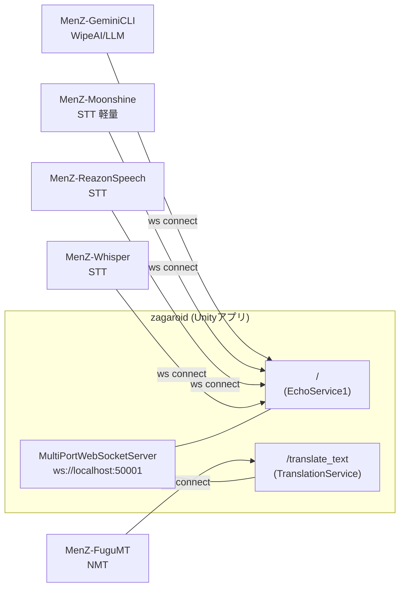

# 兄弟アプリ（MenZ-*）連携

> **このドキュメントが扱う範囲**: zagaroid と同居するローカル兄弟アプリ群（`MenZ-Whisper` / `MenZ-ReazonSpeech` / `MenZ-Moonshine` / `MenZ-FuguMT` / `MenZ-GeminiCLI`）との接続トポロジ、JSON-RPC 2.0 契約、設定対応、起動順序、運用上の注意。
> **扱わない範囲**: 各兄弟アプリの内部実装（モデル選定・チューニング等は各リポジトリの `README.md` を参照）。zagaroid 側の字幕パイプライン・翻訳・Discord 経路の詳細（→ `docs/architecture.md` / `docs/features/*`）。

## 1. 接続トポロジ

zagaroid 側は **WebSocket サーバ** として `ws://localhost:50001/` を待ち受け、すべての兄弟アプリが **クライアント** として接続してくる片方向トポロジで設計されている。



**ポイント**:

- すべての兄弟アプリは **クライアント側**。zagaroid を先に起動しなくても、各アプリは自動再接続（指数バックオフ）で待機する
- `/` には複数種類のクライアントが同時接続しうる（STT 複数 + Wipe AI 同時起動など）。**ブロードキャストでメッセージが配られる**ので、各アプリは「自分宛のメソッドだけ拾う」運用
- 翻訳（NMT）だけは別パス `/translate_text` に分離されている

zagaroid 側の実装は `Assets/Scripts/WebSockets/MultiPortWebSocketServer.cs:48-66` を参照。

## 2. 兄弟アプリ一覧

| リポジトリ | 役割 | 接続先 | 使う JSON-RPC メソッド | zagaroid 側で扱うファイル |
| :-- | :-- | :-- | :-- | :-- |
| `MenZ-Whisper` | 音声認識（STT、Whisper 系） | `ws://host:50001/` | `recognize_audio` (受) → `notifications/subtitle` (送) | `Assets/Scripts/WebSockets/MultiPortWebSocketServer.cs` |
| `MenZ-ReazonSpeech` | 音声認識（STT、ReazonSpeech / NeMo） | `ws://host:50001/` | `notifications/subtitle` (送) ※ recognize_audio もサポート想定 | 同上 |
| `MenZ-Moonshine` | 音声認識（STT、軽量） | `ws://host:50001/` | `recognize_audio` (受) → `notifications/subtitle` (送) | 同上 |
| `MenZ-FuguMT` | 翻訳（NMT、CPU/GPU） | `ws://host:50001/translate_text` | `translate_text` (受) → JSON-RPC 結果 (送) | `Assets/Scripts/Translation/TranslationController.cs`、`MultiPortWebSocketServer.cs` |
| `MenZ-GeminiCLI` | ワイプ AI（コメント生成 LLM） | `ws://host:50001/` | `notifications/subtitle` (受／送) | `Assets/Scripts/WebSockets/MultiPortWebSocketServer.cs`（`BroadcastToWipeAIClients`） |

> 「(受)」は **兄弟アプリ側がリクエストとして受け取る** メソッド、「(送)」は兄弟アプリ側が送出する通知またはレスポンスを示す。zagaroid 側は逆方向。

## 3. JSON-RPC 2.0 共通規約

zagaroid と兄弟アプリの間は **JSON-RPC 2.0** に準拠する独自プロトコル（コード上は "MCP" と表記されているが、Anthropic の公式 Model Context Protocol とは別物）。

### 3.1 メッセージ形式

通知（`id` なし）:

```json
{
  "jsonrpc": "2.0",
  "method": "<method_name>",
  "params": { ... }
}
```

リクエスト（`id` あり）:

```json
{
  "jsonrpc": "2.0",
  "id": "<uuid>",
  "method": "<method_name>",
  "params": { ... }
}
```

レスポンス（`id` で対応付け）:

```json
{
  "jsonrpc": "2.0",
  "id": "<uuid>",
  "result": { ... }
}
```

エラーレスポンス:

```json
{
  "jsonrpc": "2.0",
  "id": "<uuid>",
  "error": { "code": -32603, "message": "...", "data": {} }
}
```

### 3.2 メソッド一覧

| メソッド | 種別 | 方向 | 用途 |
| :-- | :-- | :-- | :-- |
| `notifications/subtitle` | 通知 | 兄弟 → zagaroid | STT 認識結果、Wipe AI コメント、Wipe → zagaroid のコメント送出 |
| `notifications/subtitle` | 通知 | zagaroid → 兄弟 | Wipe AI へ字幕／コメントをブロードキャスト |
| `recognize_audio` | リクエスト | zagaroid → STT | Discord 音声を送って認識依頼（STT モード時のみ） |
| `translate_text` | リクエスト | zagaroid → NMT | 日↔英翻訳依頼（`TranslationMode="NMT"` 時） |

zagaroid 側の実装位置:

- 受信ルーティング — `Assets/Scripts/WebSockets/MultiPortWebSocketServer.cs:172-257` (`RouteMcpMessage`)
- ブロードキャスト送出 — `Assets/Scripts/WebSockets/MultiPortWebSocketServer.cs:343-365` (`BroadcastToWipeAIClients`)
- 音声認識リクエスト送出 — `Assets/Scripts/WebSockets/MultiPortWebSocketServer.cs:373-419` (`SendAudioRecognitionRequest`)
- 翻訳リクエスト送出 — `Assets/Scripts/Translation/TranslationController.cs:111-172` (`TranslateWithNmt`)

### 3.3 `notifications/subtitle` のスキーマ

```json
{
  "jsonrpc": "2.0",
  "method": "notifications/subtitle",
  "params": {
    "text": "認識/コメントテキスト",
    "speaker": "actor 名",
    "type": "subtitle | comment",
    "language": "ja"
  }
}
```

| フィールド | 必須 | 値 |
| :-- | :--: | :-- |
| `text` | ✓ | 表示／処理対象のテキスト |
| `speaker` | ✓ | `ActorConfig.actorName` と一致する想定。zagaroid 側で `GetActorByName()` 解決に使う |
| `type` | ✓ | `"subtitle"`（字幕）or `"comment"`（コメント）。Wipe AI の TTS 条件に効く |
| `language` | ✓ | 現状 `"ja"` 固定で運用 |

### 3.4 `recognize_audio` のスキーマ

```json
{
  "jsonrpc": "2.0",
  "method": "recognize_audio",
  "params": {
    "speaker": "actor 名",
    "audio_data": "<Base64 PCM16LE>",
    "sample_rate": 16000,
    "channels": 1,
    "format": "pcm16le"
  }
}
```

zagaroid 側からは **通知形式（`id` なし）でブロードキャスト** している点に注意（`Assets/Scripts/WebSockets/MultiPortWebSocketServer.cs:387-411`）。複数 STT が同時接続している場合、どれが応答するかは各 STT 側の実装に依存する。

> **重要**: zagaroid → STT は通知のみ。応答は別経路（`notifications/subtitle`）で戻ってくるため、リクエスト ID で対応付けはしていない。発話とテキストの紐付けは `params.speaker` のみで行う。

### 3.5 `translate_text` のスキーマ

```json
{
  "jsonrpc": "2.0",
  "id": "<uuid>",
  "method": "translate_text",
  "params": {
    "text": "翻訳対象",
    "speaker": "話者識別子（任意）",
    "source_lang": "ja",
    "target_lang": "en",
    "priority": "normal"
  }
}
```

レスポンス:

```json
{
  "jsonrpc": "2.0",
  "id": "<uuid>",
  "result": {
    "translated": "Hello",
    "processing_time_ms": 234.56,
    "speaker": "話者識別子"
  }
}
```

zagaroid 側はリクエスト ID と コールバックを `Assets/Scripts/Translation/TranslationController.cs:16, 143, 252-258` で対応付け、10 秒タイムアウト付きで待機する。

## 4. 各兄弟アプリ詳細

### 4.1 MenZ-Whisper

- **役割**: OpenAI Whisper / faster-whisper による STT
- **接続先**: `ws://<host>:50001/`
- **動作モード**:
  - **ネットワークモード** — zagaroid からの `recognize_audio` を処理し、`notifications/subtitle` で返す（STT モード時の主役）
  - **マイクモード** — 単独でマイク入力を認識（zagaroid なしでも動く）
  - **同時実行** — 両方を並列に動作可能
- **設定キー（`config.ini`）**:
  - `[mode] enable_network` / `enable_microphone`
  - `[websocket] host` / `port`（既定 `50001`）
  - `[model] model_size`（`tiny`〜`large-v3`）, `use_faster_whisper`
  - `[inference] device`（`auto` / `cpu` / `cuda` / `mps`）, `compute_type`
  - `[microphone] device_id` / `speaker`
- **zagaroid 側**: STT モード（`DiscordSubtitleMethodStr="STT"`）時に `Assets/Scripts/Discord/DiscordBotClient.cs:369-399` から `MultiPortWebSocketServer.SendAudioRecognitionRequest()` を経由してリクエストが飛ぶ
- **既知の制約**:
  - faster-whisper は MPS（Apple Silicon GPU）非対応。`use_faster_whisper = false` で openai-whisper にフォールバック
  - 同時実行時はモデルを共有するため、双方の負荷が同じプロセスに乗る

### 4.2 MenZ-ReazonSpeech

- **役割**: NeMo + ReazonSpeech モデルによる日本語特化 STT
- **接続先**: `ws://<host>:50001/`（既定 `127.0.0.1:50001`）
- **特徴**: マイク入力を Silero VAD で区切って自動認識し、結果を `notifications/subtitle` で送る運用が中心。zagaroid 側は受信側のみで完結する
- **追加機能**: 別途 `ws://localhost:60001` を **サーバとして** 立て、Unity から PCM16LE バイナリを直接受け取るモードがある（サブプロトコル `pcm16.v1`）。zagaroid 側設定キーは `RealtimeAudioWsUrl`（既定 `ws://127.0.0.1:60001`）
- **設定キー（`config.ini`）**:
  - `[websocket] host` / `port`
  - `[model] name`（既定 `reazon-research/reazonspeech-nemo-v2`）
  - `[silero_vad] threshold` / `min_speech_duration_ms` / `min_silence_duration_ms`
  - `[recognizer] pause_threshold` / `phrase_threshold` / `pre_speech_padding_ms` / `post_speech_padding_ms`
  - `[audio_ws] enabled` / `host` / `port`（Unity → ReazonSpeech 直送モード用）
- **zagaroid 側**: 受信ルートは MenZ-Whisper と共通。`RealtimeAudioWsUrl` を使う直送モードは `Assets/Scripts/CentralManager.cs:309-314` を参照
- **既知の制約**: `text_type=2`（MCP 形式）の出力で zagaroid と話す。古い `text_type=0`（ゆかりねっと）/`1`（ゆかコネ NEO）も並存

### 4.3 MenZ-Moonshine

- **役割**: Moonshine Voice モデルによる軽量 STT
- **接続先**: `ws://<host>:50001/`
- **位置づけ**: MenZ-Whisper と **同一の JSON-RPC I/F**（`recognize_audio` ↔ `notifications/subtitle`）。エンジンだけを差し替えた実装
- **設定キー（`config.ini`）**:
  - `[model] model_path` / `model_arch`（空欄なら自動ダウンロード）
- **zagaroid 側**: MenZ-Whisper と完全に同等の扱い。同時起動時はどちらが応答するかは負荷次第
- **既知の制約**: 認識精度・対応言語は Whisper / ReazonSpeech に劣るが、CPU 単独でも実用速度

### 4.4 MenZ-FuguMT

- **役割**: FuguMT（HuggingFace `staka/fugumt-en-ja` / `ja-en`）による NMT
- **接続先**: `ws://<host>:50001/translate_text`（**他と異なるパス**）
- **動作**: クライアントモードで zagaroid に接続し、`translate_text` リクエストを処理して結果を返す
- **設定キー（`config/fugumt_translator.ini`）**:
  - `[WEBSOCKET] host` / `port` / `path`（規約上 `/translate_text`）
  - `[TRANSLATION] device` / `gpu_id` / `max_length` / `num_beams` / `temperature` / `use_cache` / `use_fp16`
  - `[PERFORMANCE] timeout_seconds`（既定 `30.0` 秒）/ `worker_threads`
- **zagaroid 側**:
  - `Assets/Scripts/Translation/TranslationController.cs` が `TranslationMode="NMT"` のときに使用
  - `MultiPortWebSocketServer.SetTranslationClientConnectionState()` が接続状態を `TranslationController.SetNmtConnectionState()` に伝搬
  - 接続が無いとき `IsNmtConnected == false` → DeepL にフォールバック（`TranslationController.cs:111-116`）
- **既知の制約**:
  - zagaroid 側のタイムアウトは **10 秒**（FuguMT 側の既定 30 秒より短い）。実環境で間に合わない場合は `TranslationController.cs:160` を調整
  - `use_fp16=true` は古い GPU で動かない場合あり

### 4.5 MenZ-GeminiCLI（ワイプ AI）

- **役割**: Gemini CLI（既定 `@google/gemini-cli`）を呼び出して LLM コメントを生成する Wipe AI 役
- **接続先**: `ws://<host>:50001/`
- **動作**:
  - zagaroid 側からの `notifications/subtitle`（`type="subtitle"` または `"comment"`）を受信し、話者ごとにバッファ
  - `lines_per_inference` 行に達するか `idle_flush_seconds` 経過で Gemini CLI を起動してコメント生成
  - 結果を `notifications/subtitle`（`type="comment"`、`speaker` は config の `speaker_name`、既定 `wipe`）として zagaroid に送り返す
- **設定キー（`config.ini`）**:
  - `[client] host` / `port` / `speaker_name` / `reconnect_*_ms` / `log_level`
  - `[processing] lines_per_inference` / `idle_flush_seconds`
  - `[prompt] system_prompt` / `template`
  - `[gemini] cli_command_template`（必須プレースホルダ `{model}` / `{prompt}`）/ `model_name` / `timeout_seconds` / `max_output_chars`
- **zagaroid 側**:
  - 字幕／コメントは `Assets/Scripts/WebSockets/MultiPortWebSocketServer.cs:343-365` の `BroadcastToWipeAIClients()` で `/` の全クライアントに配られる
  - 受信側で `actor.type == "wipe"` の Actor として扱われる必要がある
  - Wipe Actor の `ttsEnabled == true` かつ `type="comment"` のときは `CentralManager.RequestVoiceVoxTTS()` 経由で VOICEVOX 読み上げ（`MultiPortWebSocketServer.cs:213-217`）
- **無限ループ防止**:
  - zagaroid 側で「Wipe 由来の字幕は再ブロードキャストしない」フィルタを入れる（`MultiPortWebSocketServer.cs:206-210`）。`actor.type != "wipe"` のときだけ `BroadcastToWipeAIClients()` を呼ぶ
  - そのため `MenZ-GeminiCLI` の `speaker_name` と zagaroid 側 `ActorConfig.actorName`／`type="wipe"` を **必ず一致させる**こと
- **既知の制約**:
  - 話者ごとのバッファは独立だが推論は逐次のため、複数話者が同時に話すと反応が遅くなる
  - Gemini CLI の OAuth／API キー設定は zagaroid 側の管轄外（GeminiCLI 自身で初回設定）

## 5. 起動順序と運用

### 5.1 推奨起動順

1. **VOICEVOX**（独立、TTS 用）
2. **zagaroid 本体**（Unity アプリ。`MultiPortWebSocketServer` を 50001 / 50002 で待ち受け）
3. **MenZ-Whisper / Moonshine / ReazonSpeech**（必要な STT）
4. **MenZ-FuguMT**（NMT を使う場合）
5. **MenZ-GeminiCLI**（Wipe AI を使う場合）

すべての兄弟アプリは自動再接続を持つので、**起動順は厳密でなくてよい**。zagaroid を後から起動しても、各アプリは指数バックオフで再試行して接続が復旧する。

### 5.2 zagaroid からの自動起動

zagaroid 側の設定で、各兄弟アプリの `run.sh` / `run.bat` を子プロセスとして自動起動できる（`Assets/Scripts/CentralManager.cs:472-555`）:

| 設定キー（PlayerPrefs） | 起動対象 | 既定遅延 |
| :-- | :-- | :-- |
| `AutoStartSubtitleAI` + `SubtitleAIExecutionPath` | STT 兄弟（任意の Whisper / Moonshine / ReazonSpeech） | 2 秒後 |
| `AutoStartVoiceVox` + `VoiceVoxExecutionPath` | VOICEVOX | 3 秒後 |
| `AutoStartMenzTranslation` + `MenzTranslationExecutionPath` | FuguMT | 4 秒後 |
| `AutoStartDiscordBot` | （内蔵 Discord BOT） | 5 秒後 |

> **注意**: GeminiCLI の自動起動は現状未対応（明示パスがない）。配信前に手動で `./run.sh` する運用を想定。

設定 UI からは `Assets/Scripts/UI/SettingUIController.cs` 経由で各実行パスを指定できる（`StandaloneFileBrowser` でファイル選択）。

### 5.3 接続状態の見え方

zagaroid 側で接続状態を直接観測する場所:

- 翻訳クライアント — `TranslationController.IsNmtConnected`（`/translate_text` への接続有無）。`SetTranslationClientConnectionState()` を経由
- STT / Wipe AI — `Sessions.Count` のみで判別可能（`MultiPortWebSocketServer.cs:404`）。「誰が」接続中かは把握していない

> **既知の課題**: zagaroid 側に「どの兄弟アプリが接続中か」を可視化する仕組みは未実装。診断時はログ（`[MCP] *クライアント接続` 等）で確認するしかない。

## 6. ループ防止と命名規約

兄弟アプリ連携で事故りやすいポイントを再掲する。

### 6.1 Wipe AI ループ防止

- `ActorConfig.type = "wipe"` の Actor を **必ず登録**する
- その Actor の `actorName` を `MenZ-GeminiCLI` の `[client] speaker_name` と **完全一致**させる
- zagaroid 側のフィルタ `actor.type != "wipe"` がループ防止の唯一の砦（`MultiPortWebSocketServer.cs:206-210`）

これが揃わないと、Wipe AI の発話が再び Wipe AI に流れて無限ループになる。

### 6.2 字幕チャネル名規約

- OBS の字幕ソース名は `{actorName}_subtitle` の規約（→ `docs/features/subtitle-pipeline.md` § 2）
- speaker 名は `ActorConfig.actorName` と一致させること。一致しない場合は `mySubtitle` フォールバック扱いになり、すべての発話が同じチャネルに合流する

### 6.3 言語コード

- ISO 639-1 小文字（`ja` / `en` / `zh` / `ko` / `ru`）を使う
- DeepL 直叩き経路だけは大文字に変換する（`TranslationController.cs:190`）

## 7. テストとデバッグ

### 7.1 各アプリ単体テスト

| アプリ | テスト方法 |
| :-- | :-- |
| MenZ-Whisper | マイクモードで起動し、認識結果がコンソールに出るか確認 |
| MenZ-Moonshine | 同上 |
| MenZ-ReazonSpeech | `python check_gpu.py` で環境チェック後、`config.ini` の `[websocket]` を有効化して起動 |
| MenZ-FuguMT | `python test_jsonrpc_client.py`（同梱）で `translate_text` を直接叩く |
| MenZ-GeminiCLI | `test_geminicli_runner.py` で CLI 起動が通るか確認 |

### 7.2 wscat による生手動テスト

任意のメッセージを zagaroid に投げて受信側ロジックの動作確認をする手順:

```bash
# Wipe AI 兄弟アプリの代わりに wscat で /  に接続
wscat -c ws://localhost:50001/

# 字幕通知を投げてみる
> {"jsonrpc":"2.0","method":"notifications/subtitle","params":{"text":"テスト","speaker":"me","type":"subtitle","language":"ja"}}
```

zagaroid 側でログ `[MCP] subtitle route: ...` が出れば正常に経路に乗っている。

### 7.3 ログ採取

zagaroid 側で観測すべきログプレフィックス:

| プレフィックス | 内容 |
| :-- | :-- |
| `[MCP]` | JSON-RPC ルーティング全般 |
| `[MCP][Translation]` | `/translate_text` の接続・送受信 |
| `[Subtitle]` | `SubtitleController` の表示・結合・キュー |
| `[SubtitleWS]` | `MultiPortWebSocketServer` → `SubtitleController` の橋渡し |
| `[TranslationController]` | DeepL/NMT 切替・フォールバック |
| `[DiscordBot]` | Discord BOT 系全般 |

## 8. 既知の制約・TODO

- **接続状態の可視化が無い**（§ 5.3）。設定 UI から「現在何が繋がっているか」が見えない。最低限 `IsNmtConnected` を表示する余地あり
- **`recognize_audio` がブロードキャスト**（§ 3.4）。複数 STT が同時に接続していると重複認識が起こる。リクエスト ID と「誰に投げるか」のルーティング規約を入れる余地あり
- **GeminiCLI の自動起動が無い**（§ 5.2）。`AutoStartWipeAI` + `WipeAIExecutionPath` の追加で揃う
- **JSON-RPC 仕様が「コード上の "MCP"」と Anthropic の MCP で混同しやすい**。本ドキュメントで「別物」と明示したが、長期的にコード内の表記を `JSONRPC_*` 等に変える方が無難
- **翻訳タイムアウトの不一致**（§ 4.4）。zagaroid 10s vs FuguMT 30s。FuguMT 側に合わせた方が無難
- **言語コードの大文字小文字**（§ 6.3）。DeepL 直叩きだけ大文字なのが地味な事故ポイント

## 9. 関連ドキュメント

- 全体像 → `docs/architecture.md`（§ 3 リポジトリ全体像、§ 7 通信プロトコル一覧）
- 字幕パイプライン → `docs/features/subtitle-pipeline.md`（§ 4 入力ソース 4 経路、§ 11 WipeAI ループ防止）
- 各兄弟アプリ内部仕様 → 各リポジトリ直下の `README.md`、特に:
  - `MenZ-FuguMT/JSONRPC_INTEGRATION.md`
  - `MenZ-FuguMT/CLIENT_MODE.md`
  - `MenZ-ReazonSpeech/MIGRATION.md`（Silero VAD 移行）
- DeepL／NMT のフォールバック詳細 → 将来の `docs/features/translation.md`
