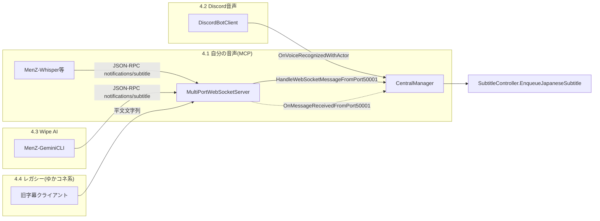
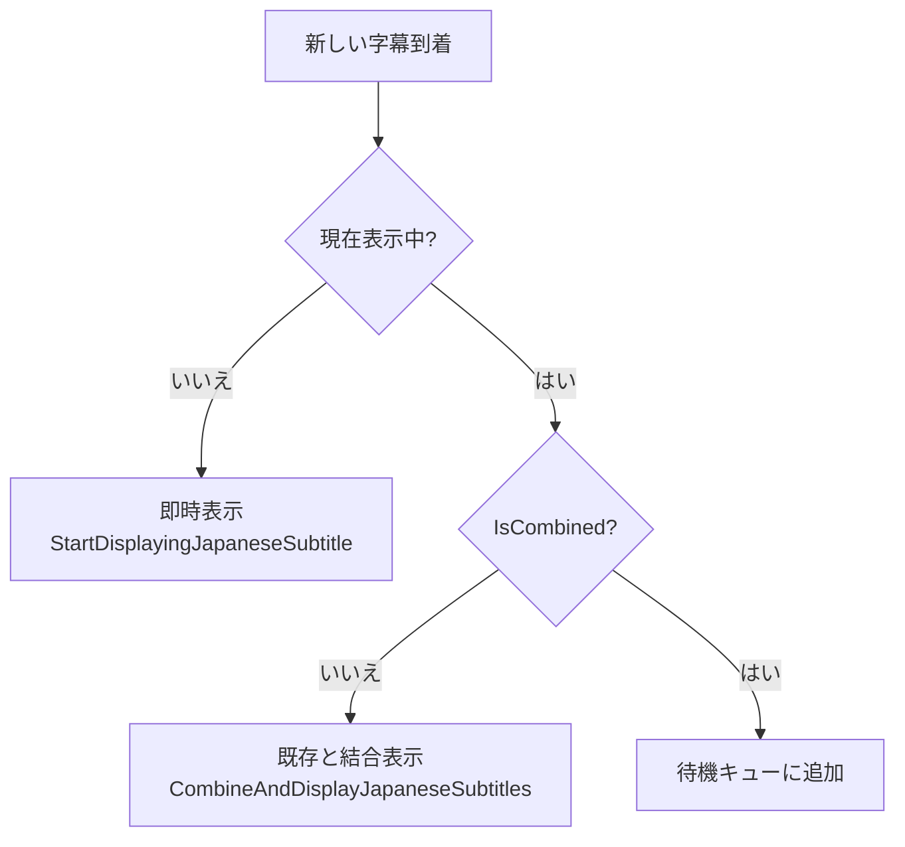

# 字幕パイプライン

> **このドキュメントが扱う範囲**: 「テキストが zagaroid に到達してから、OBS の字幕ソースに反映され、消えるまで」の縦串。入力経路、キュー管理、結合表示、表示時間計算、翻訳、OBS 送出、字幕イベントの拡張ポイントまで。
> **扱わない範囲**: Discord の音声受信から音声認識までの詳細（→ `docs/features/discord-voice.md` 予定）、各 STT/NMT 兄弟アプリの内部仕様（→ `docs/companion-apps.md` 予定）、Twitch コメントを字幕として扱うフロー（→ `docs/features/twitch-comments.md` 予定）。

## 1. 概要

字幕パイプラインは zagaroid の最も太い縦串。次の責務を一手に引き受ける。

- 4 種類の入力経路（自分の音声、Discord 音声、Wipe AI、レガシー）から到着する **日本語テキスト** を受け取る
- 同じ「チャネル」に重なって到着した字幕の **キュー管理／結合表示** を行う
- 文字数に比例した **表示時間** を計算する
- 必要なら **英語字幕の翻訳** を非同期で発火し、OBS の英語字幕ソースに送出する
- **OBS WebSocket v5** 経由で OBS のテキストソースを更新する
- 表示開始／終了時に **字幕イベント** を発行し、Avatar の表示制御等にフックさせる

中心はシングルトン `SubtitleController`。すべての字幕入力経路は最終的に `SubtitleController.EnqueueJapaneseSubtitle()` に集約される。

## 2. ユーザーから見た振る舞い

OBS の Studio 上で、actor ごとに次のテキストソースを並べておく前提:

| OBS テキストソース名 | 中身 |
| :-- | :-- |
| `{actorName}_subtitle` | 日本語字幕（その actor の発話） |
| `{actorName}_subtitle_en` | 英語字幕（翻訳が有効な場合のみ） |

たとえば自分の actorName が `me`、友人が `zagan` の場合:

- `me_subtitle` / `me_subtitle_en`
- `zagan_subtitle` / `zagan_subtitle_en`

字幕の挙動として、ユーザーは次の体験を得る:

- 発話／コメントに対して、該当 actor の OBS テキストソースに日本語が入る
- 表示時間（文字数 × 設定）が経過すると **空文字に置換されて消える**
- 直前の字幕がまだ消えていないうちに次の発話が来た場合、**改行で結合**して同じ枠内に並ぶ（最大表示時間でクランプ）
- さらに重なって到着した分はキューに積まれ、現在の字幕が消えるたびに順次表示される
- `ActorConfig.translationEnabled` が ON、または Actor 未登録の話者であれば、`*_subtitle_en` にも英訳が遅れて入る

## 3. 関連スクリプト

| ファイル | 役割 |
| :-- | :-- |
| `Assets/Scripts/Subtitle/SubtitleController.cs` | 字幕キュー・結合・表示時間管理。OBS への送出依頼。字幕イベント発行 |
| `Assets/Scripts/CentralManager.cs` | 4 経路の入力を受け取り `SubtitleController.EnqueueJapaneseSubtitle()` に橋渡し。OBS イベント `OnObsSubtitlesSend` のハブ |
| `Assets/Scripts/WebSockets/MultiPortWebSocketServer.cs` | 50001 / `/` での JSON-RPC ルーティング。`actor.translationEnabled` を見て `enableTranslation` を決める |
| `Assets/Scripts/Translation/TranslationController.cs` | 英語字幕の翻訳を実行（DeepL or NMT、フォールバック付き） |
| `Assets/Scripts/WebSockets/OBSWebSocketClient.cs` | `OnObsSubtitlesSend` を購読し OBS WebSocket v5 の `SetInputSettings` リクエストに変換 |
| `Assets/Scripts/Models/ActorConfig.cs` | `translationEnabled` / `type` などフラグの定義 |
| `Assets/Scripts/Canvases/MainCanvasAvatarController.cs` | `OnSubtitleEnded` を購読してアバターを非表示に切り替える消費側の例 |

## 4. 入力ソース（4 経路）

すべての経路は最終的に `SubtitleController.EnqueueJapaneseSubtitle(japaneseText, japaneseSubtitle, englishSubtitle, isFromWipe)` を呼ぶ。引数のうち重要なのは:

- `japaneseSubtitle` — 日本語字幕の OBS ソース名（＝チャネル）。原則 `{actorName}_subtitle`
- `englishSubtitle` — 英語字幕の OBS ソース名。空文字なら翻訳しない
- `isFromWipe` — Wipe 由来かのフラグ（現時点では DTO に保持されているのみで再ループ防止には未使用。実際の防止は経路 4.3 側で行う）



### 4.1 自分の音声（MCP風 JSON-RPC）

`MenZ-Whisper` 等が `ws://localhost:50001/` に接続し、認識結果を `notifications/subtitle` で送ってくる経路。ペイロード例:

```json
{
  "jsonrpc": "2.0",
  "method": "notifications/subtitle",
  "params": {
    "text": "こんにちは",
    "speaker": "me",
    "type": "subtitle",
    "language": "ja"
  }
}
```

ルーティングは `Assets/Scripts/WebSockets/MultiPortWebSocketServer.cs:179-223` で行う:

1. `params.speaker` から `CentralManager.GetActorByName()` で `ActorConfig` を引く
2. チャネル名を `ResolveSubtitleFromSpeaker()` で `{actorName}_subtitle` に解決（ヒットしなければ `mySubtitle` フォールバック）
3. `actor.translationEnabled ?? true` で翻訳の可否を決め、`CentralManager.HandleWebSocketMessageFromPort50001(subtitle, text, enableTranslation)` を呼ぶ
4. `CentralManager` 側で `enableTranslation == true` なら `englishSubtitle = subtitle + "_en"` を組み立てて `SubtitleController.EnqueueJapaneseSubtitle()` に渡す（`Assets/Scripts/CentralManager.cs:861-871`）

> **重要**: Actor が見つからないときは `?? true` で **翻訳が走る** 規約。新規スピーカーがフォールバック経路で `mySubtitle` チャネルに合流する仕様になっている。Actor を登録するなら `translationEnabled` の設定を意識すること（既定 `false`、`Assets/Scripts/Models/ActorConfig.cs:11`）。

### 4.2 Discord 音声 → 字幕

`DiscordBotClient` で actor ごとにバッファリングされた PCM が STT 結果として戻ってきたら、`OnVoiceRecognizedWithActor` イベント経由で `CentralManager` に通知される。

`Assets/Scripts/CentralManager.cs:702-736` の `HandleDiscordVoiceRecognizedWithActor` が:

1. `actorName` から `ActorConfig` を解決（見つからなければスキップ）
2. チャネル名を `actor.actorName + "_subtitle"` に組み立てる
3. **英語字幕は無し**（`englishSubtitle = ""`）で `SubtitleController.EnqueueJapaneseSubtitle()` を呼ぶ
4. 並行して `BroadcastToWipeAIClients(text, speaker, "subtitle")` で Wipe AI にも転送

> Discord 経路では現状 `englishSubtitle` を渡していないため、友人発話の英語翻訳は OBS には出ない。出したくなったら `actor.translationEnabled` を見て `actorName + "_subtitle_en"` を組み立てる修正が必要。

### 4.3 Wipe AI（コメント生成 LLM）

`MenZ-GeminiCLI` が生成したコメントは、`type` が `"comment"`（または `"subtitle"`）の `notifications/subtitle` として戻ってくる。経路 4.1 と同じルートを通るが、追加で次の処理が走る（`Assets/Scripts/WebSockets/MultiPortWebSocketServer.cs:206-217`）:

- `actor.type != "wipe"` のときだけ Wipe AI にも再ブロードキャスト → **無限ループ防止**
- `actor.type == "wipe" && messageType == "comment" && actor.ttsEnabled == true` のとき、VOICEVOX で読み上げ（`CentralManager.RequestVoiceVoxTTS()`）

字幕のキュー投入そのものは経路 4.1 と全く同じ。Wipe Actor の `translationEnabled` を ON にすれば AI コメントも英語化される。

### 4.4 レガシー（ゆかコネ NEO 等）

JSON-RPC ではない平文の字幕を `ws://localhost:50001/` に送ってくる旧クライアント向けの互換経路。`Assets/Scripts/WebSockets/MultiPortWebSocketServer.cs:131-146`:

- `IsMcpFormat()` が false → `OnMessageReceivedFromPort50001` を発火
- `CentralManager.HandleWebSocketMessageFromPort50001(string, string)` が `enableTranslation: false` で呼び出される（`Assets/Scripts/CentralManager.cs:850-852`）
- 結果として **英語字幕は出ない**
- `ResolveSubtitleSourceToSpeaker()` で `xxx_subtitle` から `xxx` を取り出し Wipe AI へは転送する

## 5. SubtitleController の内部状態とキュー管理

`SubtitleController` はチャネル（OBS の字幕ソース名）ごとに次の 2 つの辞書を持つ（`Assets/Scripts/Subtitle/SubtitleController.cs:23-25`）:

- `subtitleQueuesByChannel: Dictionary<string, Queue<CurrentDisplaySubtitle>>` — チャネル別の待機キュー
- `currentDisplayByChannel: Dictionary<string, CurrentDisplaySubtitle>` — チャネル別の現在表示中エントリ

`CurrentDisplaySubtitle` は次のフィールドを持つ DTO（`Assets/Scripts/Subtitle/SubtitleController.cs:199-221`）:

```text
japaneseText        : 表示中の日本語字幕
japaneseSubtitle    : 日本語の OBS ソース名（＝チャネル）
englishSubtitle     : 英語の OBS ソース名（空なら翻訳しない）
displayDuration     : 表示時間（秒）
remainingDuration   : 残り表示時間（秒）
IsCombined          : 既存字幕と結合済みか
IsFromWipe          : Wipe 由来フラグ（参考情報）
```

### 5.1 キュー投入の判断ロジック

`ManageJapaneseSubtitleDisplay()` がチャネルの状態に応じて 3 通りに分岐する（`Assets/Scripts/Subtitle/SubtitleController.cs:113-130`）:



ポイント:

- **1 回までは結合できるが、結合済みの字幕にさらに新規をぶつけてもキューに積まれる** という非対称ルール。3 行以上の同時表示を避けたい意図と思われる
- キューが消化されるのは `Update()` で `remainingDuration <= 0` になったタイミング（`Assets/Scripts/Subtitle/SubtitleController.cs:43-76`）
- 結合時は OBS には改行 `\n` 区切りでまとめて送る（`Assets/Scripts/Subtitle/SubtitleController.cs:152`）

### 5.2 表示時間の計算式

`CalculateDisplayDuration()` の式（`Assets/Scripts/Subtitle/SubtitleController.cs:100-107`）:

\[
\text{duration} = \mathrm{clamp}\Big(\max\big(\frac{\text{charCount}}{\max(1, \text{CharsPerSec})},\ \text{MinDisplayTime}\big),\ \text{MinDisplayTime},\ \text{MaxDisplayTime}\Big)
\]

実装上は `Mathf.Max(duration, MinDisplayTime)` の後に `Mathf.Clamp(duration, MinDisplayTime, MaxDisplayTime)` を重ねるため、結局 `MinDisplayTime ≤ duration ≤ MaxDisplayTime` の範囲に落ちる。

設定キー（PlayerPrefs。詳細は § 9）:

- `CharactersPerSecond` （既定 `4`）
- `MinDisplayTime` （既定 `4.0`）
- `MaxDisplayTime` （既定 `8.0`）

結合時は **既存の残り時間 ＋ 新規の displayDuration** を再クランプする（`Assets/Scripts/Subtitle/SubtitleController.cs:151-156`）。これにより「短い字幕の連発」では時間が積み上がっていくが、`MaxDisplayTime` 以上には伸びない。

### 5.3 字幕クリアのタイミング

`Update()` で `remainingDuration` が 0 を切ったとき:

1. `CentralManager.SendObsSubtitles(channel, "")` で日本語ソースを空文字化
2. `englishSubtitle` があれば同様に空文字化
3. `OnSubtitleEnded(channel)` を発火
4. `currentDisplayByChannel` から削除
5. キューに次があれば即座に表示開始

> 重要なのは「字幕は明示的に空文字を送って消す」点。OBS 側にテキストが残り続けないよう、起動 → 終了の対称性を保っている。

## 6. 翻訳の発火条件と対象

英語字幕の翻訳は次の場合だけ走る:

- `EnqueueJapaneseSubtitle()` の引数 `englishSubtitle` が空文字でないとき
- かつ既存字幕の終了に伴うキュー消化で `nextEntry.englishSubtitle` が空文字でないとき

呼び出しは `TranslateSubtitleCoroutine()`（`Assets/Scripts/Subtitle/SubtitleController.cs:180-196`）。実体は `CentralManager.TranslateForSubtitle()` 経由で `TranslationController.Translate()` に委譲する。

`TranslationController.Translate()` の挙動（`Assets/Scripts/Translation/TranslationController.cs:49-102`）:

- `PlayerPrefs["TranslationMode"]` の値で **DeepL 優先** or **NMT 優先** を決める（既定 `"deepl"`）
- 優先翻訳が失敗したらもう片方にフォールバック
- 両方失敗時は **元のテキスト**（日本語のまま）が `englishSubtitle` の OBS ソースに入る — 空文字ではない点に注意
- 同一言語と判定された場合（NMT 経路のみ）は翻訳をスキップして元テキストを返す

翻訳処理は **キュー投入と非同期** に走るため、英語字幕は日本語字幕より遅れて反映されることが多い。NMT は 10 秒タイムアウト付き（`Assets/Scripts/Translation/TranslationController.cs:160-164`）。

## 7. OBS への送出

`SubtitleController` は OBS を直接叩かない。代わりに `CentralManager.SendObsSubtitles(textSourceName, text)` を呼び、`OBSWebSocketClient` がイベント `CentralManager.OnObsSubtitlesSend` を購読して OBS WebSocket v5 にリクエストする（`Assets/Scripts/WebSockets/OBSWebSocketClient.cs:176-201`）。

OBS 側に投げるリクエストは `SetInputSettings` で:

```json
{
  "op": 6,
  "d": {
    "requestType": "SetInputSettings",
    "requestId": "<GUID>",
    "requestData": {
      "inputName": "<textSourceName>",
      "inputSettings": { "text": "<text>" }
    }
  }
}
```

OBS との接続が切れている場合、`OBSWebSocketClient.HandleObsSubtitlesSend()` は再接続コルーチンを起動して **送出を破棄する**（`Assets/Scripts/WebSockets/OBSWebSocketClient.cs:178-184`）。再接続成功後にも以前の字幕は再送されないため、OBS 接続断中の発話は字幕として失われる点は要注意。

## 8. 字幕イベントと拡張ポイント

`SubtitleController` は字幕の表示開始・終了を `static event` で公開している（`Assets/Scripts/Subtitle/SubtitleController.cs:18-21`）:

```csharp
public delegate void SubtitleEventDelegate(string channel);
public static event SubtitleEventDelegate OnSubtitleStarted;
public static event SubtitleEventDelegate OnSubtitleEnded;
```

引数の `channel` は `{actorName}_subtitle`。購読側は語尾を取り除いて actor を解決する規約（`MainCanvasAvatarController.ResolveActorBySubtitleChannel()` が好例、`Assets/Scripts/Canvases/MainCanvasAvatarController.cs:766-777`）。

現状の購読者と用途:

| 購読者 | 用途 |
| :-- | :-- |
| `MainCanvasAvatarController` | `OnSubtitleEnded` を受けて `avatarShowWithTalk` が ON な actor のアバターを非表示に戻す |

> 拡張ポイントとしては「字幕が出ているあいだだけ何かを見せる/動かす」用途に向いている。Avatar 以外にも、ピン留め通知や視聴者メーターなどの演出を後付けしやすい。

## 9. 関連設定

### 9.1 PlayerPrefs

| キー | 型 | 既定値 | 影響 |
| :-- | :-- | :-- | :-- |
| `CharactersPerSecond` | int | `4` | 表示時間の計算速度 |
| `MinDisplayTime` | float | `4.0` | 短文でもこの秒数は表示する |
| `MaxDisplayTime` | float | `8.0` | 結合・長文でもここで打ち切る |
| `TranslationMode` | string | `"deepl"` | `"deepl"` or `"NMT"` |
| `DeepLApiClientKey` | string | `""` | DeepL Free API キー |
| `MySubtitle` | string | `""` | Actor 未マッチ時のフォールバック日本語字幕ソース名 |
| `MyEnglishSubtitle` | string | `""` | 同上の英語側（旧設定。現状ロジックでは英語側は `subtitle + "_en"` 自動命名のため未参照） |
| `ObsWebSocketsPassword` | string | `""` | OBS WebSocket 認証用 |

設定 UI は `Assets/Scripts/UI/SettingUIController.cs`（UI Toolkit）。

### 9.2 ActorConfig

`Assets/Scripts/Models/ActorConfig.cs`:

| フィールド | 型 | 既定 | 字幕パイプラインへの影響 |
| :-- | :-- | :-- | :-- |
| `actorName` | string | `""` | チャネル名生成のキー（`{actorName}_subtitle`） |
| `translationEnabled` | bool | `false` | 経路 4.1 / 4.3 で `enableTranslation` フラグになる |
| `type` | string | `"local"` | `"wipe"` のみ Wipe AI 再転送・TTS の特別処理対象 |
| `ttsEnabled` | bool | `false` | `type=="wipe"` かつ `comment` のときに VOICEVOX 読み上げ |

> Actor を登録する際は `translationEnabled` をデフォルト OFF から **意識して ON** にする必要がある。OBS 側で `*_subtitle_en` ソースを作っただけでは英語が出ない。

## 10. WipeAI ループ防止のルール

字幕パイプライン上、Wipe AI ↔ zagaroid の双方向通信が無限ループにならないよう次の規約を守る（`Assets/Scripts/WebSockets/MultiPortWebSocketServer.cs:206-210`）:

- 字幕通知を受けたとき `actor?.type != "wipe"` のときだけ `BroadcastToWipeAIClients()` を呼ぶ
- Wipe AI 自身のコメント（`type="wipe"` の Actor 由来）は再ブロードキャストされない
- 加えて `EnqueueJapaneseSubtitle()` の `isFromWipe` 引数（DTO に保持）はリザーブ済み拡張ポイント。将来の細粒度フィルタ用

新たに「Wipe からの返信を別の Wipe に流す」ような構成を入れる場合は、ここにフィルタを追加する。

## 11. 既知の制約・TODO

- **Discord 経路に英語字幕が無い**: 4.2 のとおり、現状 `englishSubtitle` を渡していない。Actor の `translationEnabled` を見て付与すべき
- **OBS 切断中の字幕は失われる**: 7 のとおり、再送キューを持っていない。再接続後の表示要件があれば `OBSWebSocketClient` 側にバッファ追加が必要
- **翻訳タイムアウトは 10 秒固定**: NMT が遅いと表示済み日本語字幕より遅れて英訳が出るが、表示時間（最大 `MaxDisplayTime=8s`）を超えると **空文字に置き換わった後の枠に英訳が入る** 不整合がありうる。`SubtitleController.TranslateSubtitleCoroutine` 完了時に「もう該当字幕は終わってるか」を確認するロジックを入れる余地あり
- **`MySubtitle` / `MyEnglishSubtitle` は旧設定**: `mySubtitle` フォールバック以外では参照されていない。`ActorConfig` への一本化が完了したら廃止検討
- **`englishSubtitle` の自動命名 (`subtitle + "_en"`) はマジックサフィックス**: OBS 側のテキストソース命名規則に強く依存。規約として `glossary.md` または `integrations/obs-websocket.md` で固定化したい
- **翻訳失敗時に元の日本語が英語ソースに入る**: フォールバック仕様（`Translate()` の最終 `result = originalText`）。意図通りなら明文化、不要なら空文字返却に変える

## 12. 関連ドキュメント

- 全体像 → `docs/architecture.md`（§ 6.1〜6.4 のシーケンス図と対応）
- 入力経路の詳細 → 将来の `docs/features/discord-voice.md` / `docs/features/twitch-comments.md`
- 翻訳ロジックの詳細 → 将来の `docs/features/translation.md`（DeepL／NMT のフォールバック挙動）
- OBS WebSocket v5 の API → 将来の `docs/integrations/obs-websocket.md`
- 兄弟アプリの JSON-RPC 契約 → 将来の `docs/companion-apps.md`
