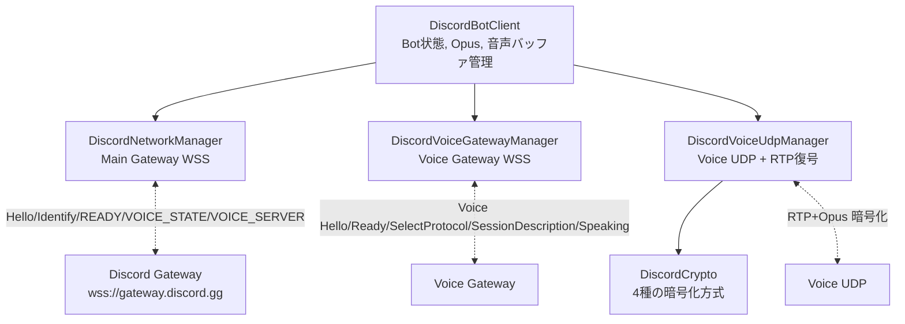
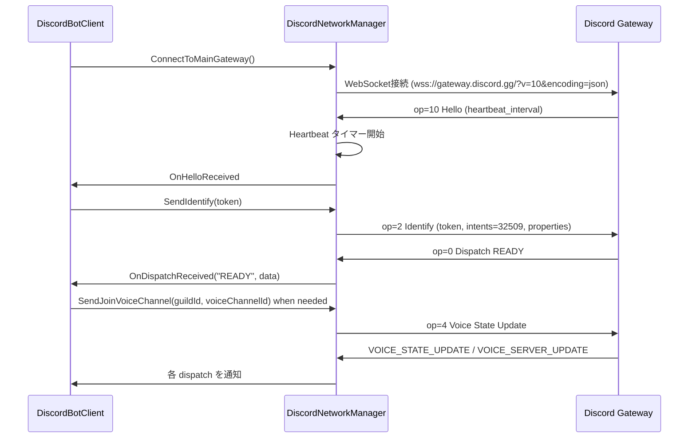
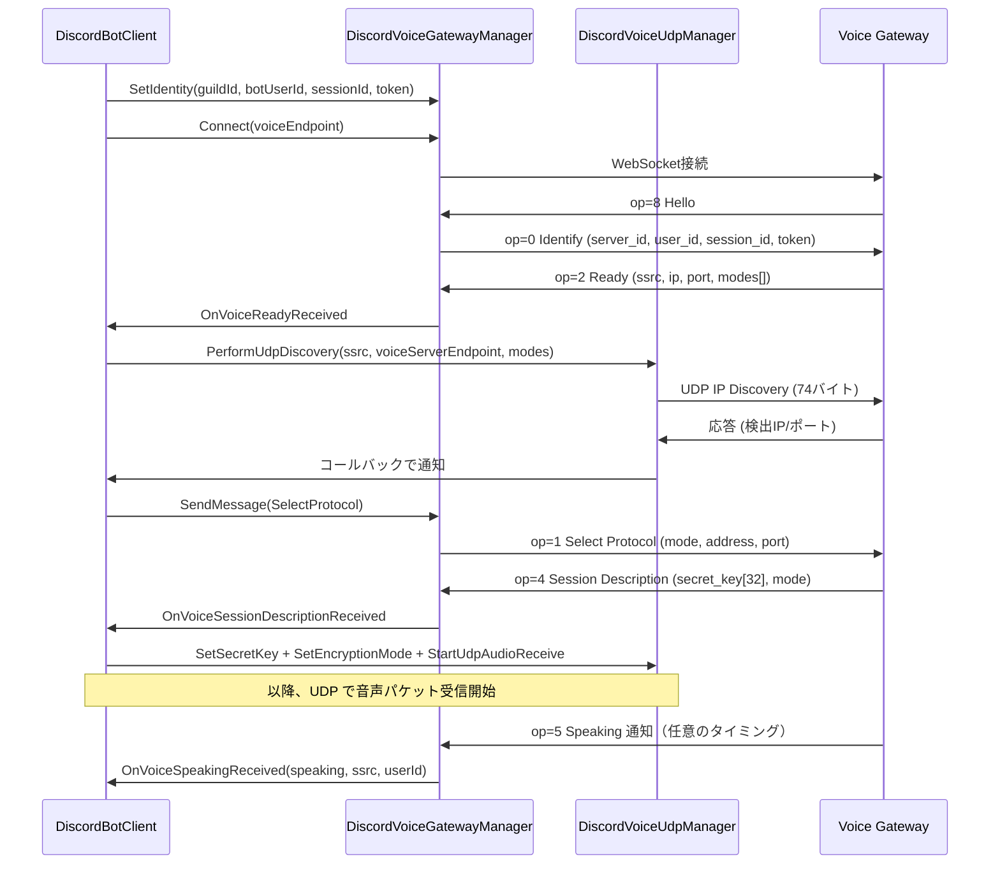
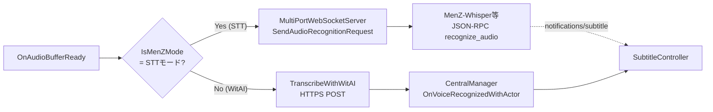

# Discord 自前実装ガイド（事故防止用）

> **このドキュメントが扱う範囲**: zagaroid が **Discord SDK を使わず自前で実装している** Gateway / Voice Gateway / Voice UDP / 暗号化 / Opus デコード / 複数話者管理の仕組み。AI／人間が変更を入れる前に必ず目を通す。
> **扱わない範囲**: Discord BOT のトークン取得手順や Developer Portal の設定（公式ドキュメント参照）。`actorName` 等のドメイン用語（→ [`docs/glossary.md`](../glossary.md)）。

## 0. 最初に読む「ここを変えると壊れる」要約

- **暗号化モードは Discord 側が選ぶ**。zagaroid 側で固定すると将来の Discord 仕様変更で全滅する（§ 4.3）
- **`SUPPORTED_ENCRYPTION_MODES` の優先順を勝手に変えない**（§ 4.3）
- **RTP 拡張プレアンブル `0xBE 0xDE` は確定的に 12 バイト除去している**。これは Discord 独自の挙動で、外すと Opus デコードがランダムに失敗する（§ 5.1）
- **rtpsize 系モードでは復号後さらに 8 バイトの Discord メタデータを剥がす**（§ 4.4 / 5.1）
- **SSRC → discordUserId → actorName の 3 段マッピング**を崩すと話者特定が壊れる。SSRC マッピングは UDP 層で一元管理（§ 6）
- **音声バッファは actor ごとに独立**。無音検出は actor 単位、UDP タイムアウトは SSRC 単位で発火する（§ 7）
- 既存テスト（`Assets/Tests/EditMode/Discord*Tests.cs`）が守っている範囲だけ自動回帰チェックされる（§ 9）。それ以外は手動配信で確認するしかない
- **2026-03-02 以降、通常ボイスチャンネルでは Discord が E2EE (DAVE) を強制**しているため `4017` で切断される。**運用はステージチャンネル前提**（§ 12）

## 1. なぜ SDK を使わないのか

Discord.Net や DSharpPlus などの SDK は Unity / IL2CPP 環境で動かないか、依存が肥大する。代わりに zagaroid は次を自前で持つ:

- WebSocket は `System.Net.WebSockets.ClientWebSocket`（標準 .NET）
- Voice UDP は `System.Net.Sockets.UdpClient`
- Opus デコードは [`Concentus`](https://github.com/lostromb/concentus)（Pure C#）
- 暗号化は `BouncyCastle.Crypto.dll`（AES-GCM / ChaCha20-Poly1305）+ `TweetNaclSharp`（XSalsa20-Poly1305）

Discord のプロトコルは安定しているが、**暗号化モードは時々追加・削除される**ので、この自前実装は中長期で必ずメンテが必要になる。

## 2. 3 層構成の概観



各層のファイル:

- `Assets/Scripts/Discord/DiscordBotClient.cs` — オーケストレーション、Opus デコード、actor 別音声バッファ
- `Assets/Scripts/Discord/DiscordNetworkManager.cs` — Main Gateway
- `Assets/Scripts/Discord/DiscordVoiceGatewayManager.cs` — Voice Gateway
- `Assets/Scripts/Discord/DiscordVoiceUdpManager.cs` — UDP / RTP / IP Discovery / Keep-Alive / 無音タイムアウト
- `Assets/Scripts/Discord/DiscordCrypto.cs` — 暗号化 4 方式の復号
- `Assets/Scripts/Discord/DiscordJsonSerialization.cs` — JSON シリアライザ設定
- `Assets/Scripts/TweetNaclSharp/` — XSalsa20-Poly1305 用ネイティブ移植

## 3. Main Gateway 接続シーケンス

`DiscordNetworkManager.cs` 担当。



注意点:

- **インテント値 `32509`** は固定。`DISCORD_INTENTS` 定数（`DiscordBotClient.cs:37`）。Discord 側で必要なインテント（GUILD_VOICE_STATES 等）が増えたらここを更新
- **OS / Browser / Device プロパティ** は `"unity"` / `"unity-bot"` / `"unity-bot"` にしている（`DiscordNetworkManager.cs:21-23`）。Discord 側のセキュリティチェックで弾かれることがあるため、変更時は要動作確認
- **シーケンス番号管理**は `_mainSequence` で行う。Heartbeat に毎回最新値を入れる
- 切断時は `_cancellationTokenSource` で受信タスクを止める。これを忘れるとアプリ終了時にプロセスが残る

## 4. Voice Gateway 接続シーケンス

`DiscordVoiceGatewayManager.cs` 担当。



注意点:

- **`Identify` は `Hello` 直後に自動送信**される（事前に `SetIdentity()` で情報を渡しておく必要あり、`DiscordBotClient.cs:1059-1064`）
- **`Speaking` イベントには `userId` が含まれる**ので、ここで SSRC → discordUserId のマッピングを更新する（`DiscordBotClient.cs:540-555`）。**音声パケット受信より先に Speaking が来るとは限らない**ので、UDP 側でプレロール（先取り）バッファを持つ
- `op=5 Resumed` は未対応。切断後は完全な再接続でやり直す
- **接続 URL は `wss://{endpoint}/?v=8` 固定**（`DiscordVoiceGatewayManager.cs:140` 周辺）。v4 / v5 / v7 だと `4017 E2EE/DAVE protocol required` で切断される（後述 § 4.1.1）
- **Identify には `max_dave_protocol_version = 0` を必ず含める**（同 § 4.1.1）。これを送らないと Discord は DAVE 対応必須クライアントとみなして即切断する

### 4.1 暗号化モードの選択

Voice Ready の `modes[]` に Discord 側がサポートする暗号化モード一覧が入って来る。zagaroid は次の優先順で **最初にマッチしたもの** を選ぶ（`DiscordVoiceUdpManager.SUPPORTED_ENCRYPTION_MODES`）:

```text
1. aead_aes256_gcm_rtpsize          # AES-256-GCM (rtpsize)
2. aead_xchacha20_poly1305_rtpsize  # XChaCha20-Poly1305 (rtpsize)
3. xsalsa20_poly1305_suffix         # 旧式 suffix モード
4. xsalsa20_poly1305                # 旧式 標準モード（既定フォールバック）
```

> **重要**: この優先順を勝手に変えると、古い Discord サーバ（一部 Voice Region で残る）で動かなくなる。新しいモードが追加されたときは、**この配列の先頭に追加**するのが正しい変更の入れ方。

#### 4.1.1 DAVE protocol（E2EE）と `max_dave_protocol_version`

Discord は 2024 年から **DAVE (Discord Audio & Video End-to-End Encryption)** を段階的に展開している。Voice Gateway version 8 以降では、Identify ペイロードに `max_dave_protocol_version` が **必須フィールド**になっており、これを送らないと `4017 E2EE/DAVE protocol required` で接続を切られる。

zagaroid は **DAVE 復号を実装していない**ため、Identify で常に `0` を送って「従来の transport-only encryption だけ使う」と宣言する（`DiscordVoiceGatewayManager.VoicePayloadHelper.CreateVoiceIdentifyPayload`）:

```text
{
  op: 0,
  d: {
    server_id, user_id, session_id, token,
    max_dave_protocol_version: 0   # ← 必須。送らないと 4017 で切断される
  }
}
```

| 値 | 意味 | zagaroid の挙動 |
| :-- | :-- | :-- |
| `0` | DAVE 非対応 | **これを送る**。従来通り `aead_*_rtpsize` / `xsalsa20_*` で暗号化 |
| `1` | DAVE v1 対応 | 未実装。送ると Discord が E2EE 鍵交換（MLS）を始めて復号できなくなる |

**変更時の注意**:

- `?v=4` などの古い Voice Gateway version に **戻してはいけない**。古い version でも `max_dave_protocol_version` を要求する挙動に変わったため、戻すと即 `4017` で切断される（2025 年時点で実測済み）
- Discord サーバ側で **「音声・ビデオに E2EE を強制」が ON のサーバ**だと、`max_dave_protocol_version=0` 宣言を拒否される可能性がある。その場合は **Discord クライアント側でサーバ管理者に E2EE を OFF にしてもらう** か、本格的に DAVE プロトコル（X3DH / MLS / SFrame）を実装する必要がある（数千行規模）
- DAVE 実装を行う場合は <https://daveprotocol.com/> を参照

### 4.2 暗号化モードごとの差異

`DiscordCrypto.DecryptVoicePacket()` の分岐（`Assets/Scripts/Discord/DiscordCrypto.cs:27-181`）:

| モード | Nonce 構成 | AAD | 末尾オフセット |
| :-- | :-- | :-- | :-- |
| `xsalsa20_poly1305` | RTP ヘッダ 12B + 0 埋め 12B | なし | 0 |
| `xsalsa20_poly1305_suffix` | **末尾 24B 全ノンス** or RTP ヘッダ 12B + 末尾 12B（両方試す） | なし | 12 or 24 |
| `aead_aes256_gcm_rtpsize` | seqSuffix(LE) 4B + 0 埋め 8B | RTP ヘッダ全体 | 4 |
| `aead_xchacha20_poly1305_rtpsize` | HChaCha20 でサブキー導出 → ChaCha20-Poly1305 | RTP ヘッダ全体 | 4 |

> `xsalsa20_poly1305_suffix` は **Discord の実装ゆれに対応**するため 2 通りのノンス構成を順に試す（`DiscordCrypto.cs:57-90`）。1 度目で失敗してもログを抑制する suppress フラグが付いているのはこのため。

### 4.3 rtpsize モードでのペイロード構造

```text
[RTP Header (12 + CC*4 + X?4:0)] [ciphertext] [Poly1305 tag (16B)] [seq_suffix (4B LE)]
```

非 rtpsize モード:

```text
[RTP Header (12B 固定)] [ciphertext + tag]
```

`IsRtpsizeMode()` でモード名に `"rtpsize"` が含まれるか判定（`DiscordVoiceUdpManager.cs:583-587`）。**新しい rtpsize 系モードが将来増えたら、文字列マッチで自動的に対応する**設計。

### 4.4 Payload Type による制御パケット除外

rtpsize モードでは、RTP ヘッダ 2 バイト目下位 7bit の Payload Type が **72〜127 の範囲外**または **パケット長 56 バイト以下**のとき、**復号を試さずスキップ**する（`DiscordCrypto.cs:108-115`、`144-148`）。これは Keep-Alive や RTCP を音声として処理しないため。

> 古い rtpsize 非対応モードでは PT チェックをしていない。これらのモードでは Discord 側が音声以外のパケットを送ってこない前提。

## 5. Opus デコード

`DiscordBotClient.DecodeOpusToPcm()` 担当（`Assets/Scripts/Discord/DiscordBotClient.cs:770-867`）。

### 5.1 RTP 拡張プレアンブル `0xBE 0xDE` の除去

復号後の Opus データの先頭 2 バイトが `0xBE 0xDE` のとき、**確定的に 12 バイト除去**する（`DiscordBotClient.cs:786-791`）:

```csharp
if (opusData.Length >= 12 && opusData[0] == 0xBE && opusData[1] == 0xDE) {
    var trimmed = new byte[opusData.Length - 12];
    Array.Copy(opusData, 12, trimmed, 0, trimmed.Length);
    inputOpus = trimmed;
}
```

これは **Discord の RTP 拡張ヘッダプレアンブル**で、rtpsize 系モードでは `DiscordVoiceUdpManager.ExtractOpusFromDiscordPacket()` が先に 8 バイト剥がしているが、それでも残るケースがあるため二重に防御している。

> **重要**: この処理を消すと、特定の Voice Region で Opus デコードが「たまに失敗する」状態になり原因究明が極めて難しい。**残すこと**。

### 5.2 デコード失敗時の 2 段フォールバック

1. **FEC（Forward Error Correction）** — `_opusDecoder.Decode(null, ..., fec=true)` で直前のパケットを復元（`DiscordBotClient.cs:802-818`）
2. **Discord 独自ヘッダ 12 バイト除去** — 上記の `0xBE 0xDE` 判定をすり抜けた場合の保険（`DiscordBotClient.cs:828-846`）

それでも失敗した場合は `_opusErrors` をインクリメントし、10 回ごとにデコーダーをリセット（`DiscordBotClient.cs:614-620`）。リセット頻度を上げすぎるとプチプチ音が増えるので注意。

### 5.3 サンプル変換チェーン

```text
Discord                           zagaroid
  Opus 48kHz stereo
  ────────────────►  Concentus.Decode  →  short[] 48kHz stereo
                                       ↓ ConvertStereoToMono
                                       short[] 48kHz mono
                                       ↓ ResampleAudioData (3:1 デシメーション)
                                       float[] 16kHz mono (-1.0〜1.0 正規化)
                                       ↓ DiscordVoiceNetworkManager.AddAudioData
```

リサンプリングは **3:1 単純デシメーション**（48kHz → 16kHz、`DiscordBotClient.cs:582-588`）。アンチエイリアスフィルタを入れていないが、Wit.AI / Whisper / ReazonSpeech は 16kHz mono を想定しており実用上問題ない。

精度を求める場合はローパスフィルタを入れる余地がある（現状は速度優先）。

## 6. 複数話者管理（SSRC マッピングの 3 段）

```text
RTPパケット.SSRC                     ──┐
                                       │
Voice Gateway op=5 Speaking            │  SSRC → discordUserId
  → SetSSRCMapping(ssrc, userId)     ──┘
                                       │
ActorConfig (discordUserId 登録済)     │  discordUserId → actorName
  → _discordUserIdToActorName[id]    ──┘
                                       │
                                       ▼
                              actor別 音声バッファ
                              DiscordVoiceNetworkManager (per actor)
```

実装ポイント:

- **SSRC マッピングは UDP 層が一元管理**（`DiscordVoiceUdpManager._ssrcToDiscordUserIdMap`）。`DiscordBotClient` 側ではキャッシュしない
- **`discordUserId` → `actorName` のマッピングは Bot 起動時に固定**（`DiscordBotClient.LoadSettingsFromCentralManager()`、`DiscordBotClient.cs:896-929`）。Bot 動作中に Actor を編集しても、Bot を再起動するまで反映されない
- **未マッピングの SSRC は「プレロール」キューに音声を一時保管**（`DiscordVoiceUdpManager.cs:489-509`）。Speaking イベントでマッピングが確立されたら、過去の音声も遡って処理する設計（PREROLL_MAX_DURATION_MS で古いものは破棄）

> **事故りやすい点**: Actor の `discordUserId` を未設定のまま運用すると、その人の音声は **完全に無視される**（プレロールにも入らず、即 return）。`Assets/Scripts/Discord/DiscordBotClient.cs:198-201` を参照。

## 7. 音声バッファリング（無音検出）

`DiscordVoiceNetworkManager`（`DiscordBotClient.cs:1160-1310`）が actor ごとに独立して持つ。

### 7.1 発火タイミング

音声バッファが `OnAudioBufferReady` を発火する条件は **3 つ**:

1. **無音 1000ms 検出** — `AddAudioData()` 内で。push-to-talk ではない通常会話だと、Discord は無音時にパケットを送ってこないため、**この経路はあまり通らない**（`DiscordBotClient.cs:1240-1244`）
2. **Voice Gateway op=5 Speaking (false)** — 発話終了通知。`DiscordBotClient.HandleVoiceSpeaking` で `ProcessBufferedAudio()` を呼ぶ（`DiscordBotClient.cs:550-553`）
3. **UDP タイムアウト** — UDP パケットが一定時間途絶えたとき。`DiscordVoiceUdpManager.OnSpeechEndDetected` 経由（`DiscordBotClient.cs:1101-1129`）

通常会話では **2 と 3 が主**。Discord はクライアント側の挙動で `Speaking=false` を送らないことがあるため、UDP タイムアウトが事実上のセーフティネット。

### 7.2 バッファサイズの下限

`ProcessBufferedAudio()` は **0.2 秒分（3200 サンプル at 16kHz）未満**のバッファを破棄する（`DiscordBotClient.cs:1257-1266`）。これは Whisper / Wit.AI に投げても認識できない長さで、誤動作を防ぐため。

### 7.3 リップシンクレベルの並行発火

`AddAudioData()` は音声を貯める一方で、**RMS 音量を `[0, 1]` に正規化**して `CentralManager.SendLipSyncLevel(level, actorName)` を発火する（`DiscordBotClient.cs:1196-1211`）。`LevelScaleTo01 = 4.0f` で増幅。`FaceAnimatorController` / `MainCanvasAvatarController` がこれを購読して口を動かす。

## 8. WitAI vs STT モードの分岐点

`OnAudioBufferReady` が発火した後、認識先が分岐する（`DiscordBotClient.OnAudioBufferReady`、`DiscordBotClient.cs:369-407`）:



切替キー: `PlayerPrefs["DiscordSubtitleMethodStr"]` が `"STT"` または `"MenZ"`（後方互換）なら STT モード、それ以外（既定 `"WitAI"`）は WitAI モード。

> **コードの旧称に注意**: `s_isMenZMode` / `IsMenZMode()` は **「STT モードかどうか」**の意味。MenZ 専用ではないので、新規コードでは `IsSttMode()` 等にリネームしたい（TODO）。

WitAI モードの実装:

- `https://api.wit.ai/speech` に **raw PCM16LE 16kHz mono** を POST（`DiscordBotClient.TranscribeWithWitAI`、`DiscordBotClient.cs:626-656`）
- `Content-Type: audio/raw;encoding=signed-integer;bits=16;rate=16k;endian=little`
- レスポンスは複数 JSON が連結／改行区切りで返ってくる独特な形式。`EnumerateWitResponseParts()` で分解し `FINAL_UNDERSTANDING` の `text` を採用
- `witaiToken` 未設定 / 認識結果空文字 / `IsCompletedSuccessfully == false` のときは静かにスキップ

## 9. テストの守備範囲

`Assets/Tests/EditMode/Discord*Tests.cs` が回帰チェックしている範囲:

| テストファイル | 守る範囲 | 守らない範囲 |
| :-- | :-- | :-- |
| `DiscordConstantsTests.cs` | `DiscordConstants` の値（サンプルレート / インテント等）が変更されないこと | 値が **正しいか**は別問題（実環境で確認） |
| `DiscordCryptoTests.cs` | 4 種の暗号化モードの **往復**（暗号化→復号で平文一致）。不正入力時のエラー挙動 | Discord 実機との互換性 |
| `DiscordGatewayPayloadBuilderTests.cs` | Identify / Heartbeat / Voice State Update / Select Protocol などの **op コードと JSON フィールド名** | フィールド値の意味的正しさ |
| `DiscordJsonDtoTests.cs` | DTO の JSON シリアライズ／デシリアライズ | フィールドの過不足検査 |
| `DiscordVoiceNetworkManagerAudioTests.cs` | `AddAudioData()` の無音検出ロジック、`ProcessBufferedAudio()` の最小長判定 | スレッド競合、リアル UDP |
| `ErrorHandlerTests.cs` | `ErrorHandler.SafeExecute*` の戻り値・例外伝搬 | — |

> **重要**: 暗号化モードの分岐や RTP プレアンブル除去は `DiscordCryptoTests` で **暗号化往復**としては守られているが、**「実機で Discord の生パケットが来ても処理できる」までは保証していない**。実機で Bot 接続してロギングするしか確認手段がない。

## 10. ここを変えると壊れる集（事故ポイント）

過去のコメント・診断ログから読み取れる地雷を列挙する。AI に変更を依頼するときは、これらに触れる場合は必ず指示すること。

| 項目 | ファイル | 注意 |
| :-- | :-- | :-- |
| `SUPPORTED_ENCRYPTION_MODES` の優先順 | `DiscordVoiceUdpManager.cs:32-37` | 新モード追加は先頭に。並べ替え禁止 |
| RTP 拡張プレアンブル `0xBE 0xDE` の 12B 除去 | `DiscordBotClient.cs:786-791` | 消すと特定 Region で Opus 失敗 |
| rtpsize モードの 8B 余分ヘッダ剥がし | `DiscordVoiceUdpManager.cs:620-626` | 上記と二重防御 |
| Payload Type による制御パケット除外 | `DiscordCrypto.cs:108-115`, `144-148` | 範囲を変えると Keep-Alive を音声扱いして暴発 |
| `DISCORD_INTENTS = 32509` | `DiscordBotClient.cs:37` | Discord 側のインテント要件が変わったら更新 |
| Voice Gateway URL `?v=8` 固定 | `DiscordVoiceGatewayManager.cs:140` 周辺 | v4 等に戻すと `4017` で切断される（§ 4.1.1） |
| Identify の `max_dave_protocol_version = 0` | `DiscordVoiceGatewayManager.VoicePayloadHelper.CreateVoiceIdentifyPayload` | 削ると `4017` で切断、値を 1 にすると DAVE 鍵交換が始まって復号不能になる |
| Identify の `os/browser/device` プロパティ | `DiscordNetworkManager.cs:21-23` | Discord 側のフィルタ強化で弾かれた事例あり |
| 3:1 デシメーション | `DiscordBotClient.cs:582-588` | アンチエイリアス無し。精度要求が上がったら見直し |
| `_opusDecodeLock` | `DiscordBotClient.cs:117` | Concentus デコーダーは非スレッドセーフ。lock 必須 |
| Bot 起動時の Actor マッピング固定 | `DiscordBotClient.cs:896-929` | 動作中の Actor 編集は反映されない |
| 0.2 秒バッファ下限 | `DiscordBotClient.cs:1257-1266` | 短すぎる発話を弾くガード |
| `LevelScaleTo01 = 4.0f` のリップシンク係数 | `DiscordBotClient.cs:1193` | 大きくするとリップシンクが過剰反応 |

## 11. デバッグ Tips

### 11.1 ログプレフィックス

| プレフィックス | 出処 | 内容 |
| :-- | :-- | :-- |
| `[DiscordBot]` | `DiscordBotClient.LogMessage` / `[DiscordVoiceUdp]` / `[DiscordVoiceGateway]` / `[DiscordNetwork]` | Bot 状態全般。`enableDebugLogging=false`（既定）だと Debug レベルは出ない |
| `[VOICE_EVENT]` | `DiscordBotClient` | 暗号化モード・SecretKey 長・SSRC・actor の組をひとまとめにした診断行。**実機問題切り分けのキー** |
| `[MCP]` | `MultiPortWebSocketServer` | `subtitle route` / `音声認識リクエスト送信` / 兄弟アプリ接続状態など、字幕パイプラインの要点 |
| `[GCM]` | `DiscordCrypto` | AES-GCM / XChaCha20 復号エラー時に AAD/IV/seqSuffix の hex を出す |

> 過去にあった `[DIAG]` / `[WS-PCM]` プレフィックスのデバッグログは整理済み。重複・連発するログを削減し、要点（接続/切断・暗号化モード確定・SSRC マッピング・音声バッファ完成・STT リクエスト送信・字幕ルーティング）が **1 発話で 1 行ずつ流れる**ことを目指している。
>
> 字幕が出ない時の最小診断ログ列（順に出れば正常、途中で途切れた箇所が原因）:
>
> 1. `[DiscordBot] Bot logged in: ...`
> 2. `[DiscordVoiceGateway] Voice Gateway Ready received`
> 3. `[DiscordBot] 🔐 Encryption mode: ...` / `[VOICE_EVENT] encryption_mode=...`
> 4. `[DiscordVoiceUdp] [VOICE_EVENT] SSRC mapping updated: ssrc=..., discordUserId=...`
> 5. `[DiscordBot] 🎤 Audio buffer ready: actorName=..., samples=..., isMenZMode=...`
> 6. `[MCP] 音声認識リクエスト送信: speaker=..., samples=..., clients=...`（`clients=0` だと兄弟アプリ未接続）
> 7. `[MCP] subtitle route: speaker=..., subtitle=..., actorType=..., enableTranslation=...`
>
> **2 で詰まる（Hello は来るが Ready が来ない）場合**は `⚠️ Voice Gateway connection closed by server: code=...` の Warning ログを必ず確認する。Discord は Identify 拒否時に [Voice Close Event Codes](https://docs.discord.com/developers/topics/opcodes-and-status-codes#voice-voice-close-event-codes) を返してくる:
>
> - `4001` Unknown opcode / バージョン不整合
> - `4004` Authentication failed（token/session_id 不正）
> - `4006` Session no longer valid
> - `4011` Server not found
> - `4012` Unknown protocol（DAVE 等、新フィールド必須化）
> - `4014` Disconnected（BOT が切られた／Channel 削除）
> - `4016` Unknown encryption mode
> - `4017` E2EE/DAVE protocol required（Identify に `max_dave_protocol_version` が無い／Voice Gateway version が古い）— `DiscordVoiceGatewayManager.CreateVoiceIdentifyPayload` で `max_dave_protocol_version = 0` を送ることと、Connect URL を `?v=8` まで上げることで回避できる

#### Unity Console フィルタで原因究明を高速化する

`CentralManager.HandleDiscordLog` はメッセージ先頭の絵文字を見て Unity Console のレベルに振り分ける（`CentralManager.cs:738-757`）:

| メッセージ先頭の絵文字 | Unity Console レベル | 例 |
| :-- | :-- | :-- |
| `❌` | Error（`Debug.LogError`） | `❌ Discord token is not set` / `❌ Voice Gateway connection failed` |
| `⚠️` | Warning（`Debug.LogWarning`） | `⚠️ Voice Gateway connection closed by server: code=4014` |
| その他 | Info（`Debug.Log`） | `🔌 ✅ ℹ️ 🔍 🎤 🔐 [VOICE_EVENT]` ほか |

このため、字幕が出ない時の調査フローは次の通り:

1. Unity Console 右上の **Info アイコンをクリックして非表示**にする
2. Warning と Error だけが残る
3. その中に `⚠️ Voice Gateway connection closed by server: code=XXXX` があれば、上の表で `XXXX` を引いて原因確定

> 補足: Console フィルタは Unity 標準で Info / Warning / Error の 3 段階のみ。「Debug だけ表示」ボタンは存在しない。zagaroid 内部の `LogLevel.Debug`（`🔍` プレフィックス）は Unity 上は Info 扱いになる。Console 検索欄に `🔍` を入れれば Debug 行だけ抽出可能。

### 11.2 PCM デバッグ再生

`DiscordBotClient.enablePcmDebug = true`（Inspector で切替）で、認識直前の PCM をローカル AudioSource で再生できる（`DiscordBotClient.PlayPcmForDebug`、`DiscordBotClient.cs:1134-1154`）。**「Discord から音声は受信できているが認識されない」**ときの切り分けに有用。

### 11.3 Wireshark / tcpdump

Discord Voice UDP は暗号化されているのでペイロードは見えないが、**SSRC とパケット頻度**は確認できる。「Speaking イベントが来てないのに UDP は流れている」状態を切り分けるとき有用。

## 12. ステージチャンネル運用（DAVE 強制への対処）

### 12.1 経緯

Discord は 2026-03-02 から **非ステージのボイスチャンネルに対して E2EE (DAVE protocol) を強制**した（[公式アナウンス](https://support.discord.com/hc/en-us/articles/38749827197591-A-V-E2EE-Enforcement-for-Non-Stage-Voice-Calls)）。zagaroid は DAVE 復号を実装していないため、Identify 時に `max_dave_protocol_version = 0` を送って「DAVE 非対応」を宣言するが、**通常ボイスチャンネルでは `4017 E2EE/DAVE protocol required` で即切断される**。

ただし公式が明言している通り **ステージチャンネル (Stage Channel) だけは E2EE 強制対象外**:

> Stage channels also will not be end-to-end encrypted.

そのため、Discord 経由で音声字幕を運用する場合は **ステージチャンネルを使うのが現在唯一の現実解**。

### 12.2 サーバ側設定（管理者作業）

1. Discord サーバ設定で「チャンネルを作成」を開く
2. チャンネルタイプで **「ステージ」** を選択（「ボイス」ではない、別タイプ）
3. zagaroid Bot のロールに、そのステージチャンネルに対して以下の権限を付与（多くは既存ロールが既に持っている）:
   - `View Channel`（チャンネルを見る）
   - `Connect`（接続）
4. 配信参加者の利便性のため、参加者ロールに **「ステージ・モデレーター」** を付与しておくと、ステージに入った瞬間に自動でスピーカー昇格して話せる（毎回スピーカーリクエストを押す手間が省ける）
5. ステージチャンネルの **ID をコピー** して zagaroid 設定の `voiceChannelId` に貼る

### 12.3 zagaroid 側の挙動

Bot はステージに入ると自動的に **観客 (Audience)** として配置される（`suppress = true`）。観客でも RTP 音声パケットは普通のボイチャと同じ仕組みで届くため、**zagaroid のコード変更は不要**。`channel_id` をステージのものに差し替えるだけで以下が順に動く:

```text
[DiscordVoiceGateway] Voice Gateway Ready received
[DiscordBot] 🔐 Encryption mode: aead_aes256_gcm_rtpsize     ← DAVE ではなく従来の transport encryption
[DiscordVoiceUdp] [VOICE_EVENT] SSRC mapping updated
[DiscordBot] 🎤 Audio buffer ready
[MCP] subtitle route
```

### 12.4 既知の警告と既知の不安定（未対処）

Stage Channel + v8 Voice Gateway 接続時に観測されている挙動。**音声受信そのものには影響しない**ため、運用上の支障がなければ現状放置で良いが、頻発するなら下記の対処が必要:

| 事象 | 内容 | 対処方針 |
| :-- | :-- | :-- |
| `op=15 Unknown Voice Gateway message: data={"any":N,"6240":N}` | v8 で追加された非公開 op。クライアント別音声品質設定とみられる。音声処理に無影響 | `DiscordVoiceGatewayManager.ProcessVoiceMessage` の無視 op リスト（現状 `11`, `18`, `20`）に `15` を追加すれば警告ごと消える |
| 接続から十数秒で `4006 Session is no longer valid` で切断される | 公式コメントは "Try reconnecting"。Stage 参加直後に Discord 側で voice_state を再構成する関係で初期セッションが一度無効化されている可能性が高い | `DiscordVoiceGatewayManager.ReceiveMessages` で close を検知したときに自動的に `Reconnect(endpoint)` を呼ぶよう繋ぐ。実装時は **無限再接続ループ**にならないようリトライ上限と back-off を入れる |

## 13. 関連ドキュメント

- 全体の3層構成 → [`docs/architecture.md`](../architecture.md) § 5.5
- 兄弟アプリへの音声認識リクエスト → [`docs/companion-apps.md`](../companion-apps.md) § 3.4 / § 4.1〜4.3
- 用語の意味 → [`docs/glossary.md`](../glossary.md)（「STTモード」「SSRC」「Opus」「FEC」「暗号化モード」等）
- 字幕パイプラインへの接続 → [`docs/features/subtitle-pipeline.md`](../features/subtitle-pipeline.md) § 4.2
- 公式仕様（外部）:
  - [Discord Gateway](https://discord.com/developers/docs/topics/gateway)
  - [Discord Voice Connections](https://discord.com/developers/docs/topics/voice-connections)
  - [Concentus](https://github.com/lostromb/concentus) — Pure C# Opus
  - [TweetNaCl](https://nacl.cr.yp.to/) — XSalsa20-Poly1305 の元実装
